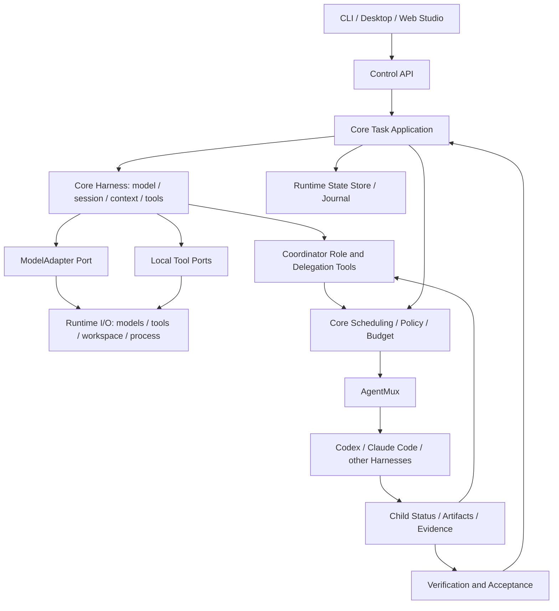
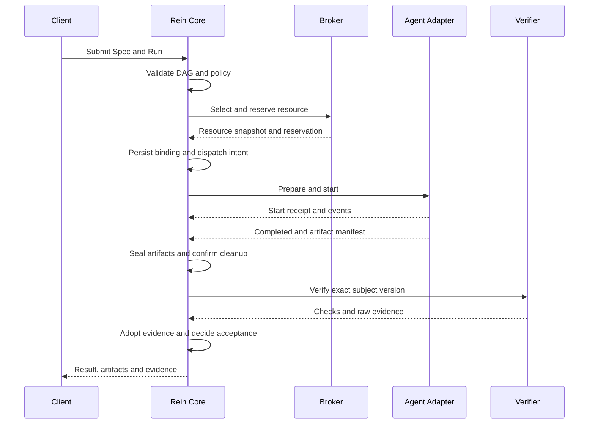

# Rein 设计文档

**REIN — Runtime for Emergent Intelligence Networks**

> 受约束、可恢复、可验证的 Agent 运行基础设施

| 项目 | 内容 |
| --- | --- |
| 文档标识 | `REIN-DESIGN-20260920` |
| 版本 | `0.5-draft` |
| 日期 | 2026-09-21 |
| 状态 | 根据当日讨论形成的设计草案，可用于评审与拆分实现；不代表新增能力已实现或全部方案已确认 |
| 主要读者 | 产品与架构负责人、Rust core 开发者、Agent/工具适配器开发者、验证与客户端开发者 |
| 当前代码基线 | `1dfa82b9d90196c2294f61914d2017449e5548e3` 加当前未提交工作区；本次只核查相关源码与契约，没有重跑运行时验收 |
| 与书籍的关系 | 本文描述 Rein 的产品演进方向；既有教程、章节顺序、快照与合同保留原义 |

本次修订按 [D14](DECISIONS.md) 明确 Rein 基础设施、Web Studio 首个验证场景、Veriflow 方法论的产品分工，并把最小客户端整合提前至 R1c。沿用 D11 名称、D12 完整 Harness/Coordinator、D13 纯步进机与 driver；S01–S16、V01–V22 保持原义。跨项目要求及首个纵切基准见 [整合规格](REIN-INTEGRATION-SPEC.md)，功能主责见 [模块设计](REIN-MODULES.md)，开发顺序见 [实施改造清单](REIN-IMPLEMENTATION-PLAN.md)。[源码调研](reports/2026-09-20-rein-architecture-research.md)保留历史来源；本次没有新增运行时代码或接通三个产品。

## 1. 设计依据与产品定位

Rein core 是具备模型调用、会话、上下文和工具循环的完整 Harness，同时拥有任务控制能力。它可以自行完成任务，也可以运行 Coordinator 角色，把合适的子任务交给外部 Agent，接收结果后继续工作；所有执行统一受工作区、权限、资源与预算约束，并以产物和验证证据决定是否完成。

Rein 定位为受约束、可恢复、可验证的 Agent 运行基础设施。产品以任务为调度单位，以产物为交接单位，以证据为验收依据；订阅感知、额度管理和异构调度服务于任务交付。Web Studio 是首个参考客户端与验证场景，CLI 同样消费控制协议，以检查基础设施可独立使用。

整体实施路径为 **需求分析 → 规格拆解（含设计）→ 基准先行 → 约束实现 → 可信验证 → 规范分发**。每一步的产物、推进条件、失败回路以及任务交付/产品发行的区别以整合规格为权威；该路径尚未全部实现为运行时门槛。

### 1.1 当日讨论如何进入设计

主要来源是 2026-09-20 的对话 [多Agent调度前景分析](https://chatgpt.com/c/6aafba39-9e44-83ea-96ef-2733cda40c18)。下表区分用户提出的问题与本文整理出的方案，避免把讨论中的建议写成已经批准的决定。

| 来源 | 用户提出 | 本文采用的设计方向 | 决定状态 |
| --- | --- | --- | --- |
| T1 | 多 Agent 调度客户端是否仍有价值 | 任务图、异构执行、上下文交接和验证作为核心；客户端提供可视化与控制 | 讨论建议，本文展开 |
| T2 | 是否支持多个订阅管理 | 把订阅、API、本地模型建模为资源，加入额度观测、规则路由和受控切换 | 用户提出范围，具体机制为本文建议 |
| T3 | 能否借用 CC Switch 的思路和账号切换逻辑 | 借鉴 Profile、配置实例化、凭证同步的思路；每次执行绑定 Profile，支持独立并发 | 用户提出参考方向，未决定代码复用 |
| T4 | 产品叫什么 | 延续 Rein，与仓库已有 D10 一致 | Rein 名称沿用既有决定 |
| T5 | 为 Rein 确定英文全名；后续明确选择 Runtime for Emergent Intelligence Networks | 正式全名采用 **REIN — Runtime for Emergent Intelligence Networks** | 用户已确认，见 D11 |

当日回答里的市场判断和套餐规则不作为已核验事实。2026-09-20 的后续调研已锁定 Codex、CC Switch、pi、Gemini CLI 等源码快照，具体机制与来源见调研报告；这类静态证据仍不能代替目标 CLI 版本下的实际适配验收。

### 1.2 系统之间的关系

- **Rein**：持有任务状态、调度决定、资源绑定、生命周期与结果采纳规则。
- **Rein core Harness**：保留并演进现有模型循环、会话、上下文、工具、扩展与局部控制能力；Coordinator 和普通执行 Agent 使用同一引擎，以角色与工具授权区分。外部 Agent 自带 Harness 由 AgentMux 接入。
- **Veriflow**：拥有方法与规则包；通过固定版本 adapter 提供记录一致性评估，Rein 持有任务运行与验收状态。现有 skill/CLI 不是现成的任务 runtime。
- **Web Studio**：首个参考客户端与验证场景，负责工作区交互、任务提交、变更审阅、预览与证据展示；R1c 接入最小控制协议，当前未建立实际连接。

用 Rein + Veriflow 开发 Web Studio 的工程验证，与用户在 Web Studio 内完成任务的产品验证分别留证。三方职责、状态权威、adapter 与验收边界见 [整合规格](REIN-INTEGRATION-SPEC.md)。

按 [D9/D12](DECISIONS.md)，Rein 原生会话、loop、工具调度、预算和证据继续归 Rust core；TypeScript 提供宿主与领域集成。外部 Harness 的内部循环归对应产品，Rein core 持有父子关系、派发约束和任务级验收，只对可观察和可执行的外部边界作出保证。

## 2. 规格：目标、范围与可观察结果

### 2.1 使用场景

**首个产品纵切。** 用户在 Web Studio 提交一个专用本地网页样例的有界修复任务；Rein 运行实现前基准、在隔离目录生成变更、复跑固定检查，Web Studio 展示 diff 和证据，并导出可复验的交付包。具体样例和 INT-B01–INT-B12 定义在整合规格，当前尚未执行。

**个人开发者跨订阅执行。** 用户登记两个不同服务的可用 Profile，提交一项带验收条件的开发任务。Rein 展示可选资源、额度信息的新鲜度和选择原因，按手动选择或规则派发。用户能看到产物、失败原因和验证结果。

**个人与工作身份隔离。** 企业仓库只允许指定组织的资源与执行环境。即使个人订阅空闲，调度器也不能把公司上下文发送过去。用户选择错误账号时，拒绝发生在上下文发送之前。

**开发—验证—修复。** 实现 Agent 在独立工作区产生变更，验证器检查指定版本。检查失败时生成有预算的修复尝试；没有充分证据时保留未确定状态。完成验收之后，合并、提交和发布仍是独立动作。

### 2.2 功能规格

表中的 MUST 是本草案对后续实现的要求，不表示当前程序已经满足。P0 是首版候选范围，P1 是后续增强。

| ID | 优先级 | 规格与可观察成功条件 |
| --- | --- | --- |
| S01 | P0 | 任务必须声明目标、输入版本、输出、工作区、约束、预算和验证计划；缺少必填项或依赖成环时拒绝启动 |
| S02 | P0 | 统一管理 Profile 与资源；同一组织下不同主体不合并，同一主体的多个配置可区分 |
| S03 | P0 | 每次执行固定 `ExecutionBinding`；并发执行不得通过改写全局活动账号互相影响 |
| S04 | P0 | 支持单节点任务及显式提供的 DAG；只有依赖已被验收且产物版本匹配，节点才能派发 |
| S05 | P0 | 支持手动选择、确定性规则及 Coordinator 的资源选择提案；统一经过能力/权限/预算准入，保存提案、最终决定、淘汰原因及策略/快照版本 |
| S06 | P0 | 展示额度来源、观测时间、窗口、重置时间及未知状态；不得把不同套餐的百分比直接相加 |
| S07 | P0 | 全局、任务、资源、共享额度池和写工作区的并发约束共同生效；每次派发原子预留可控制的预算 |
| S08 | P0 | 支持日志/事件、取消、终态查询及重启后的核对；已派发而结果未知的执行不得自动重放 |
| S09 | P0 | 产物绑定执行与输入版本；验证结果绑定 Spec、产物与验证器版本，退出码 0 或 Agent 声称成功不足以完成任务 |
| S10 | P0 | 已知失败可进行受预算约束的重试、修复或换资源；跨账号/服务交接必须重新经过数据策略与上下文检查 |
| S11 | P0 | 核心状态可持久化，CLI/桌面断开不丢失执行记录；事件重放只恢复视图，不重发外部副作用 |
| S12 | P0 | 首批目标是 Claude Code 与 Codex 两类外部 Agent；每种接入方式须单独取得适配器测试证据后才能标为支持 |
| S13 | P1 | 基于可核验的上下文版本、历史任务结果和成本观测改进路由；保留可解释的规则回退 |
| S14 | P1 | 扩展更多模型 API、本地模型、MCP 控制入口和远程执行环境；不推迟 S15 所需的首个原生模型接入 |
| S15 | P0 | Rein core 保留完整 Harness：无需安装外部 Agent CLI，也能通过 ModelAdapter、会话/上下文与 ToolExecutor 完成模型—工具—反馈循环，支持预算、取消与验证；旧公开入口和合同保持兼容 |
| S16 | P0 | 同一 core Harness 可运行 Coordinator 角色：提交有界子任务、经 AgentMux 调度外部 Agent、观察/等待/取消并消费结果后继续；父子身份、授权、总预算与恢复可核对，模型提案不能绕过准入或直接写 Acceptance |

### 2.3 首版边界

首版采用本地单用户部署：完整 Rust core Harness、一个本地状态库、受管执行进程、CLI 和桌面可连接 API。先保住 R1a 原生独立执行闭环，再验证 R1b Coordinator → 一个外部 Agent → 结果返回并继续，并在 R1c 完成 Web Studio 最小客户端整合；其开发可在 R1a 控制/证据合同稳定后与 R1b 并行。随后扩展双 Agent、多资源与 DAG。Coordinator 使用同一模型/工具引擎；候选图和资源偏好经统一准入后才能派发。用户也可直接指定外部执行，不强制增加一轮模型规划。

首版不包含跨机器分布式调度、多租户 SaaS、任意插件沙箱、模型训练、自动购买额度或兑换付费权益。R1c 只覆盖客户端最小任务闭环，完整桌面体验与正式产品发行在 R4 验收；高级学习路由在 R5。账号切换机制不承担突破资源原有限制的职责。

### 2.4 非功能要求与起始默认值

| 维度 | 要求 |
| --- | --- |
| 一致性 | 相同请求键不会生成两份运行；一个可变执行工作区同时只允许一个写入者；终态不可被迟到事件改回运行中 |
| 可恢复性 | 提交成功的任务与状态转换在进程重启后仍可查询；存储不可写时停止新派发 |
| 可解释性 | 每次绑定保存候选过滤、选择规则、额度新鲜度和预算预留；无法判断的字段保留 `null`/`unknown` |
| 可扩展性 | 客户端只依赖版本化控制接口；适配器不直接写核心状态库；领域验证器不负责调度 |
| 数据边界 | 账号凭证不进入模型上下文、任务文件、事件和普通日志；日志/产物继承工作区访问边界 |
| 可测性 | 调度时钟、资源快照、适配器事件及故障注入可替换；离线测试与真实服务验收分开 |
| 性能 | 首版先记录队列等待、启动耗时、控制请求延迟和事件积压；没有测量前不承诺吞吐或延迟数值 |

建议起始值：全局最多 **2** 个执行、单 Profile 最多 **1** 个执行、每任务最多 **3** 次执行尝试、每次尝试最长 **30 分钟**、单任务自运行开始最长 **90 分钟**（含等待与验证）、取消宽限 **5 秒**、额度观测 TTL **60 秒**。验证器也占受管进程配额。未知额度默认要求显式允许有界探测；额外 API 支出默认上限为 **0**。

这些数值是保守的调试起点，尚未实测校准。实际并发取用户设置、适配器验证上限、Profile 限制与资源约束的最小值；用户可以调整默认值。超时之后仍须确认进程退出和副作用状态，不能把“计时结束”写成“执行未发生”。外部 Agent 无法提供可靠费用上限时，不能承诺硬费用封顶；要求硬上限的任务不得选用该能力未知的路径。

## 3. 领域模型与身份

### 3.1 对象职责

| 对象 | 含义 | 权威所有者 |
| --- | --- | --- |
| `Mission` | 用户目标及其 Spec 版本，可包含一个或多个任务 | Task Service |
| `TaskSpec` / `TaskNode` | 不可变的目标契约，以及引用它的 DAG 节点 | Task Service |
| `Run` | 对某一版任务图的一次运行 | Runtime Core |
| `Attempt` | 某节点的一次执行尝试；重试/换资源产生新 ID | Runtime Core |
| `AgentSession` | 外部或原生会话，可被多个顺序尝试引用 | 原生状态归 core/harness；外部原生状态归对应 Harness，core 持有映射与有效性 |
| `AccountIdentity` | 身份提供方命名空间下的用户主体与组织归属 | Account Registry |
| `AccountProfile` | 身份、凭证引用、配置版本与可用执行方式的组合 | Account Registry |
| `Subscription` | 订阅/企业席位等权益及其关联账号 | Resource Broker |
| `Resource` | 一种可调度执行资源，关联 Profile、执行方式、模型能力和额度池 | Resource Broker |
| `QuotaPool` / `QuotaObservation` | 共享用量范围及有来源、有时效的额度观察 | Resource Broker |
| `ExecutionBinding` | 将一次尝试固定到资源、Profile、执行环境和策略版本 | Runtime Core |
| `ContextBundle` | 可跨执行环境交接的任务信息与有版本的材料引用 | Context Manager |
| `Artifact` / `ChangeSet` | 不可变产物，或相对明确基线的一组候选改动 | Artifact Store |
| `VerificationPlan` / `Evidence` | 预先定义的检查与实际执行证据 | Verification Service |
| `Acceptance` | 核心对匹配 Spec 的有效证据作出的任务判定 | Runtime Core |

`Task` 不等同于对话，`AgentSession` 不等同于账号。身份、执行服务、模型和订阅分别建模：同一身份可以通过不同配置执行，同一订阅可以影响多个产品或模型，同一模型也可能存在多种计费路径。

Profile 使用 Rein 生成的稳定 ID。身份去重键采用 `(identityProvider, principalId)`；组织/工作空间成员关系独立保存，不能仅用 `workspaceId` 去重。主体信息无法可靠读取时，使用本地身份 ID 并标明未确认，不猜测两个账号相同。Rein 项目工作区使用 `projectWorkspaceId`，避免与服务商的组织工作空间 ID 混淆。

### 3.2 核心数据结构草案

以下 TypeScript 仅用来描述语言中立的数据结构，尚不是已发布 SDK。ID 为不透明字符串，哈希为带算法前缀的内容摘要；时间采用 UTC RFC 3339，金额使用整数微单位和明确币种，wire 字段使用 camelCase。

```ts
type Ref = { id: string; digest: string };
type Versioned = { id: string; version: number };
type Money = { currency: string; micros: number };

interface TaskSpec {
  id: string;
  specVersion: number;
  specDigest: string;
  goal: string;
  inputs: Ref[];
  outputs: { name: string; kind: string; required: boolean }[];
  projectWorkspaceId: string;
  baseSnapshot: Ref;
  writeScope: string[];
  requiredCapabilities: string[];
  policy: Ref;
  verificationPlan: Ref;
  budget: {
    maxAttempts: number;
    maxAttemptDurationMs: number;
    maxTaskDurationMs: number;
    maxConcurrentExecutions: number;
    maxAdditionalSpend: Money;
  };
}

interface TaskNode {
  id: string;
  spec: Ref;
  dependencies: { taskId: string; outputName: string }[];
}

interface ExecutionBinding {
  id: string;
  runId: string;
  taskId: string;
  attemptId: string;
  resource: Versioned;
  profile: Versioned | null;
  subscriptionId: string | null;
  quotaPoolIds: string[];
  adapterId: string;
  adapterVersion: string;
  executionProvider: string;
  executionMode: "external_agent" | "native_harness";
  fundingSource: "subscription" | "api" | "local" | "enterprise_seat";
  capabilityReport: Ref;
  requestedModel: string | null;
  projectWorkspaceId: string;
  executionWorkspaceId: string;
  baseSnapshot: Ref;
  contextBundle: Ref;
  policy: Ref;
  budgetReservationId: string;
  leaseId: string;
  fence: number;
}
```

`specDigest` 由固定的规范化序列化计算：包括目标、输入、验收、约束和预算，排除摘要字段自身及显示性元数据。依赖输出由核心解析为确切 Artifact 引用；缺失输出不能靠名称猜测。图或 Spec 变化创建新版本，使受影响的绑定、批准和证据失效。

绑定在 `starting` 前持久化，之后不可原地换账号、模型要求或工作区。换资源产生新 Attempt，旧事件与失败保留。实际模型可能无法由 Agent 精确回报，此时 `observedModel` 保持未知，不能把请求值当成实际值。

尝试预算在写入启动派发意图时消耗，已尝试启动但未成功也计数；只读候选筛选不计数。单次时限不能超过任务剩余时间；重启不延长原截止时间。Run 级策略还约束所有节点与验证器的汇总费用、时限和并发，不能通过拆分 DAG 绕过总预算。取消、失败或费用不明时，保留已用和未确定金额。

数值 schema 须限制为范围内的非负安全整数，次数和时限必须大于零；金额币种明确且不能隐式换汇。文本、路径、数组和事件帧均需长度上限，具体上限随独立协议冻结。不能只靠 TypeScript 的 `number` 和静态类型进行输入校验。

## 4. 总体架构



运行调用可以经过适配器与外部进程；源码依赖保持向内：领域类型与应用服务定义端口，数据库、进程、凭证、文件系统实现端口，CLI/daemon 入口负责装配。初版采用模块化单体，图中的组件不等于独立微服务。首批产品采用 `rein-core`、`rein-agentmux`、`rein-runtime` 三个包；`agentmux` 与 `runtime` 依赖 core，runtime 装配 AgentMux，core 不依赖外部实现。完整 Harness 位于 `core/harness`，调度 Agent 位于 `core/orchestration`；核心通过端口调用由 runtime 注入的模型、工具和 AgentMux 实现，因此源码依赖仍无环。详细依赖图见 [模块设计](REIN-MODULES.md)。

核心只接受适配器的“观察结果”，由状态机决定是否采纳；适配器、UI、模型和工具都不能直接修改任务终态。调度器持有选择算法，资源代理持有资源事实与预留，二者通过事务协调，避免同时各自计算可用额度。

## 5. 核心组件

| 组件 | 输入与输出 | 所有权与主要约束 |
| --- | --- | --- |
| Task Service | 用户目标/显式 DAG/委派提案 → 校验后的 Spec、节点与 Run | 校验成环、缺失依赖、输出引用和预算；候选变更不能改写在途 Attempt 绑定 |
| Coordinator Agent | 用户目标、资源能力和子任务反馈 → 执行/委派/调整提案 | 使用 core Harness 的会话和工具循环；可独立执行或选择允许资源；无权绕过准入、扩大预算或自行验收 |
| Scheduler | 就绪节点、候选资源和策略 → 绑定提案/等待原因 | 先硬约束过滤，再规则排序；保存决策轨迹，不持有凭证 |
| Resource Broker | Profile、权益、能力及额度观测 → Resource 快照与预留 | 管理共享池、可用性、健康状态、冷却与并发容量 |
| Account Registry | 显式登记的身份与 Profile → 版本化配置引用 | 区分个人/工作身份、主体、组织和执行配置；不向其他组件暴露 secret |
| Credential Backend | 凭证引用、Profile lease → 私有句柄和轮换回执 | runtime 保管秘密；AgentMux/ProfileCodec 提供原生格式；core 管身份版本和写入者规则 |
| Runtime Core | 绑定、上下文与执行参数 → Attempt 状态和规范化事件 | core/application 唯一决定业务转换；请求派发、取消、核对与回收；runtime 执行效果并事务持久化 |
| AgentMux / Agent Adapter | 已绑定执行/批准回复 → 外部会话句柄与观察 | 翻译外部 Harness 协议；显式声明能力，禁止隐藏重试、换账号和直接写任务状态 |
| Workspace Manager | 输入快照、写范围、隔离要求 → 执行工作区与锁 | 保留用户未提交改动，隔离并发写入，导出 ChangeSet，核对回写基线 |
| Context Manager | Spec、依赖产物、来源权限 → ContextBundle | 控制交接内容、版本和信任等级；不给跨身份会话直接复制秘密或隐式记忆 |
| Core Harness / Tool Host | 模型/上下文 → 工具动作、结果回填和下一轮 | 原生完整 Harness 为产品主线；模型与工具经可替换端口执行；Coordinator 的委派工具也走策略检查，TS 宿主保留旧合同 |
| Artifact Store | 文件、diff、报告和日志 → 内容寻址引用 | 核验路径、类型和哈希；读者消费不可变版本，保留输入与生产者关系 |
| Verification Service | 计划、待验产物和环境 → 原始证据与检查结果 | 运行固定检查；区分结果失败与检查未能执行；不自行发布产物 |
| State Store / Journal | 状态变更、命令与事件 → 持久化记录及可重放视图 | 提供版本比较、事务、幂等索引和恢复信息；不把事件回放当作命令重放 |

### 5.1 三类适配边界

1. **Model Adapter**：接收消息和工具声明，返回一个模型 turn。当前仓库已有相关接口，适用于 Rein 自己控制 loop 的执行方式。
2. **Tool Extension**：执行一次工具调用。当前 `rein-extension/0.1` 和 `0.2` 属于此层。
3. **Agent Adapter**：启动或连接一个已有完整 Harness 的 Agent，返回进程/会话级事件。今天讨论的外部 Agent 调度需要新增此层。

任务调度、模型路由、HTTP 端点 failover 与工具调度也分属不同层：TaskScheduler 在 core/scheduling，Coordinator 的计划在 core/orchestration，原生 ModelRouter/ToolScheduler 在 core/harness，外部 Harness 的内部选择按能力观察，API gateway 暂不进入首批。AgentMux registry 只按已固定的 adapter ID 查找实现。

三类端口不能共用一个含糊的 `ProviderAdapter`。外部 Agent 自带工具和批准机制，Rein 的 ToolExecutor 不能自动接管它们。只有适配器与实际隔离环境可以证明某项策略可执行时，才可接收需要该约束的任务；否则拒绝派发或使用用户明确接受的受信模式。

## 6. 账号、配置与订阅资源

### 6.1 从 Profile 到执行绑定

```ts
interface AccountProfile {
  id: string;
  version: number;
  identityId: string;
  purpose: "personal" | "work";
  organizationId: string | null;
  credentialRef: string;
  credentialGeneration: number;
  runtimeConfig: Ref;
  allowedAdapterIds: string[];
  status: "unverified" | "ready" | "auth_required" | "quarantined";
}

interface Resource {
  id: string;
  version: number;
  fundingSource: "subscription" | "api" | "local" | "enterprise_seat";
  executionMode: "external_agent" | "native_harness";
  profileId: string | null;
  subscriptionId: string | null;
  adapterId: string;
  executionProvider: string;
  environment: Ref;
  capabilityReport: Ref;
  quotaPoolIds: string[];
  quotaObservationIds: string[];
  maxConcurrency: number;
  pricingRef: Ref | null;
  health: "healthy" | "degraded" | "unavailable" | "unknown";
}
```

本地无认证资源可以没有 Profile；相应绑定中的 Profile 也允许为空，仅限该资源已声明无需身份的情形。`runtimeConfig` 是脱敏的配置模板，凭证通过私有句柄注入，`pricingRef` 缺失表示价格未知，不表示免费。`enterprise_seat` 仍可能关联 Subscription；资金来源不能取代具体的额度池和计费合同。`executionMode` 描述外部 Agent/内置 Harness，`fundingSource` 描述资金来源，模型提供方与执行环境另有字段；合法组合由能力与策略校验。

推荐流程为：登记 Profile → 探测身份和能力 → 取得 Profile lease → 实例化私有配置 → 无任务输入地核对身份 → 启动任务 → 运行中按能力持续核对 → 同步凭证变化 → 回收临时环境 → 释放 lease。必须在首次发送任务内容之前确认身份；不能先启动含敏感任务的 Agent 再检查账号。

每个 Profile 使用独立的受保护配置目录。每次执行可以拥有临时运行配置，但认证状态的权威写入者必须明确。不得用“全局切到账号 A、启动、再切到 B”实现并发；无法指定独立配置空间的适配器不进入多 Profile 并发模式。具体目录参数、环境变量和身份探测方式由各适配器经实际版本验证后定义。

用户主动修改外部 CLI 的身份时，现有绑定不能静默跟随。适配器应上报身份漂移，核心暂停后续派发并核对在途结果。若只能验证启动时的身份，能力报告必须说明该观察范围。

### 6.2 凭证生命周期

```text
Profile reference
  -> acquire credential lease
  -> materialize private runtime config
  -> Agent runs and may refresh credentials
  -> reconcile with expected credential generation
  -> cleanup temporary material
  -> release lease
```

核心只保存 `credentialRef`，不把 token 放入 SQLite 普通记录、命令参数或 ContextBundle。可选凭证后端包括官方客户端管理的配置与操作系统凭证库；是否需要复制认证文件由适配器能力决定，不能假定所有服务都适合复制登录状态。

凭证轮换使用 `(credentialRef, generation)` 与排他写 lease。旧快照不能覆盖新 refresh token；发现并发变更返回 `credential_conflict`，进入核对或重新认证。同一账号若共享轮换凭证，首版串行使用该凭证；不能靠复制目录宣称已经安全支持并发。进程仍可能写认证文件时，lease 到期也不能直接交给下一执行。

`revoke` 需区分“移除 Rein 的本地引用”和“请求服务商撤销会话”，后者只有适配器支持且获得用户授权才执行。清理临时目录不意味着服务端凭证已撤销。

### 6.3 额度模型

```ts
interface QuotaObservation {
  id: string;
  poolId: string;
  dimension: string;
  unit: "requests" | "tokens" | "credits" | "percent" | "unknown";
  windowStart: string | null;
  windowEnd: string | null;
  resetsAt: string | null;
  remaining: number | null;
  limit: number | null;
  availability: "available" | "limited" | "exhausted" | "unknown";
  source: "official_api" | "cli_report" | "manual" | "inferred";
  observedAt: string;
  expiresAt: string;
  confidence: "reported" | "estimated" | "unknown";
}
```

一个资源可受多个窗口约束，一份权益也可能被多个 Profile、模型或 Rein 之外的使用共同消耗。共享关系通过 `QuotaPool` 表达；已知共享时不能给每个 Profile 各发一份完整余额。共享关系未知时保留不确定性，并采用保守并发策略。

本地预留只约束 Rein 自己，不等于服务商扣费或保留额度。预算账本与服务商观测分开保存，不能从新观测值再次扣掉已经体现在其中的用量。无法获取精确用量时，记录估计、范围或未知值，不伪造每任务 token 数。

重置时间到达只触发重新观测，不自动宣布满额。过期、解析失败和权限不足都不能显示为“100% 可用”。未知额度可以按显式策略进行一次有界探测，失败后更新冷却与可用性。API 的实际费用与订阅的固定成本、利用率分开显示；不同套餐利用率只有在定义明确分母时才计算。

## 7. 调度、上下文与工作区

### 7.1 调度顺序

Coordinator 可通过自身模型循环拆任务、指定候选 Agent 并解释选择原因。下面的确定性调度流程负责核验和实际派发；模型选择不会代替这些检查。规则/手动模式仍可独立运行。

1. 校验 Spec 版本、依赖 Acceptance 和精确产物引用，得到就绪节点。
2. 根据组织、数据类别、模型/工具能力、执行位置、隔离要求、费用政策过滤资源。
3. 检查健康状态、认证、额度新鲜度、冷却、并发、写锁及剩余预算。
4. 对用户指定、Coordinator 提案或规则选择执行相同准入；只在允许集合内决定资源，保存提案与最终决定。提案不可行时按显式策略返回原因或选择允许的回退。
5. 在同一核心事务中检查对象版本，预留并发与预算，获取工作区/Profile lease，写入绑定和派发意图；冲突则重新选择。
6. 实例化环境，派发前再次确认有效策略、身份与 lease，再启动 Agent。

首版规则顺序建议为：显式指定 → 工作区允许的偏好资源 → 同策略域内可验证的上下文复用 → 可用订阅资源 → 已授权的 API fallback。并列候选以稳定 ID 排序，便于复现。硬约束不参与加权，不能用“更便宜”抵消组织或权限不匹配。

额度不足时优先展示等待重置、切换允许资源或修改预算等选项。只有 Task policy 已允许相应 fallback，且不会越过费用/数据边界时，才能自动选择下一资源。没有可行候选时保持 `blocked` 并给出具体原因，不重复空转。

后续可引入 `capabilityMatch + contextAffinity + expectedQuality - marginalCost - latency - failureRisk` 等评分，但特征必须有测量来源、归一化方式和版本。没有历史样本时不把固定权重描述为最优调度；通过同一任务集比较质量、耗时、附加费用和失败率后再启用。

### 7.2 上下文交接

`ContextBundle` 包含任务 Spec 引用、当前输入快照、已验收依赖产物、允许读取的材料、未完成事项和失败证据；每项材料记录内容摘要、来源、敏感等级与允许的目的资源。

上下文亲和度只能依据已观察的来源版本、兼容会话标识和策略域估计。旧会话读过同一文件名，不意味着理解了最新文件。上下文摘要保留出处，并作为派生数据，不覆盖原始文件或验证记录。

切换厂商时默认创建新会话，交接结构化任务与产物。只有原适配器在相同身份、兼容版本下声明并验证会话恢复能力，才允许恢复原生会话；不能假设两个 Agent 的内部历史互通。

### 7.3 工作区与回写

任务从带内容摘要的输入快照启动。Git HEAD 之外的已修改和未跟踪输入也需要显式纳入快照，不能以 HEAD 代替用户正在工作的版本。共享目录中的写操作持有排他锁；并发写任务使用独立工作树或副本。

工作树解决文件竞争，不构成操作系统沙箱。要求网络/文件系统隔离的任务必须绑定经过验证的执行环境。外部 Agent 不能实施路径限制时，可在受控副本中生成候选，随后核对全部变更；仅靠事后 diff 无法保证运行时没有读取或发送其他数据。

输出以 `ChangeSet(baseSnapshot, files, hashes)` 保存，另建整合步骤处理目标基线、冲突和审批。Agent 不直接合并到用户工作树。完成独立分支验证后，整合结果仍须运行相关检查，因为两个分别通过的改动不保证组合后通过。

## 8. 状态机、失败与恢复

### 8.1 任务状态

| 状态 | 进入条件 | 允许的主要后继 |
| --- | --- | --- |
| `draft` | Spec 尚未提交或不完整 | `ready`、`blocked`、`cancelled` |
| `blocked` | 等依赖、资源、额度、审批或人工核对 | 原因解除后重新校验到 `ready`；或 `failed`、`cancelled` |
| `ready` | 输入和策略有效，依赖已验收 | `running`、`blocked`、`cancelled` |
| `running` | 当前 Attempt 已取得绑定并进入启动/执行 | `verifying`、`ready`、`blocked`、`failed`、`cancelled` |
| `verifying` | 执行产物已封存，正在核验指定版本 | `succeeded`、`ready`（有界修复）、`blocked`、`failed`、`cancelled` |
| `succeeded` | 必需检查有效且通过，交付物齐全 | 无；后续输入变更创建新版本/新运行 |
| `failed` | 明确不可恢复或预算耗尽 | 无；显式重试创建新运行 |
| `cancelled` | 调度停止，在途执行/验证进程已结束且结果已核对 | 无；需要继续时创建新运行 |

等待原因用结构化 `blockedReason` 表达，例如 `dependency_failed`、`quota_unavailable`、`approval_required`、`reconciliation_required`。依赖失败不会让下游自动成为成功；用户可取消后继或修订计划。

### 8.2 执行尝试状态

```text
reserved -> starting -> running -> collecting -> completed
    |           |          |           |
    +-----------+----------+-----------+-> failed
                |          |
                |          +-> cancelling -> cancelled
                +----------------------------> outcome_unknown
```

`completed` 表示本次执行已结束并收集产物，随后才进行任务验证。`reserved` 且确认未派发时可以取消并释放预留。派发确认、进程终止或产物收集存在歧义时进入 `outcome_unknown`，任务转入人工/自动核对等待，不能直接用失败重试替代核对。

取消采用“停止新派发 → 请求适配器取消 → 宽限期 → 必要时结束受管进程树 → 查询/检查结果”的流程。取消请求被接收不等于进程已退出；终止进程不撤销它已经完成的文件写入、远程任务或网络请求。

Coordinator 的 `waiting_children` 是原生 HarnessSession 的等待原因；父 Attempt 保持同一身份且尚未结束。恢复后继续该 Attempt 的剩余预算和未完成工具结果，不能因任务重新就绪而再启动一份父执行。父子结果消费位置随会话 revision 持久化。

### 8.3 故障处理表

| 情况 | 核心处理 | 可否自动换资源/重试 |
| --- | --- | --- |
| 确认未启动的资源拒绝或额度不足 | 标记未派发，释放相应预留，记录原因 | 策略允许且预算足够时可以 |
| 认证失效或身份不匹配 | 隔离 Profile，阻止后续上下文发送 | 仅可选其他已允许 Profile；不能改写现有绑定 |
| 正常结束但验证失败 | 保存失败证据，形成新的修复 Attempt | 可在剩余尝试/费用/时间内修复 |
| 已知失败且进程已退出，存在部分文件改动 | 封存部分产物，确认新尝试的输入与工作区 | 完成核对并构造有效输入后可以 |
| 连接中断、启动回执丢失或进程状态不明 | `outcome_unknown`，查询会话/进程、读回产物 | 核对之前不可以 |
| 执行完成后输入或验证环境变化 | 证据记为 stale，重新读取和验证 | 不重复原副作用；只重跑适用检查 |
| 数据库写入失败、磁盘满 | 停止新派发，尝试控制现有进程并暴露存储故障 | 不可以静默继续 |
| 外部 Agent 要求用户批准 | 保存请求与目标摘要，任务等待 | 只能由有权限的客户端响应；模型输出不是批准 |

“未收到成功响应”不能推出“副作用未发生”。持久化派发意图与真实进程启动之间存在故障窗口；若适配器不支持幂等启动和可查询句柄，该窗口只能先记未知，不能声称 exactly-once execution。

## 9. 接口设计

本节是拟新增的接口草案。现有 [contracts/README.md](contracts/README.md)、[extension-v0.1](contracts/extension-v0.1.md)、[extension-v0.2](contracts/extension-v0.2.md) 与维护合同仍是已存在边界的权威来源。后续落地时应将确认后的新协议放入 `contracts/`，由同一 schema 生成类型、示例与契约测试；本文转为引用，不保留第二套手写权威定义。

### 9.1 客户端控制接口

建议使用 JSON-RPC 2.0 加版本握手，逻辑协议暂称 `rein-control/0.1-draft`。首版 daemon 监听仅当前用户可访问的 Unix domain socket；stdio 作为托管子进程模式的可选传输。远程 HTTP/SSE 后续单独定义认证与传输合同。

| 方法 | 主要输入 | 结果与语义 |
| --- | --- | --- |
| `system.hello` | 客户端版本、支持协议范围 | 选定协议、功能能力、大小限制；无兼容版本则拒绝 |
| `profile.register` | 显示名、身份/凭证引用、配置与用途 | Profile ID 和待探测状态；不接受聊天文本里的 secret |
| `profile.probe` | Profile ID、预期版本 | 身份、认证、配置隔离与能力报告；未知字段显式保留 |
| `resource.list` | 工作区/用途过滤、分页参数 | 脱敏资源、观测时间、共享池与不可用原因 |
| `resource.refresh` | 资源 ID | 观测请求 ID；返回后不意味着额度已更新 |
| `task.submit` | Spec、DAG、`clientRequestId` | 持久化 task/graph 引用，尚未执行 |
| `task.run` | 图引用、策略、`clientRequestId` | Run ID 和起始状态；异步执行 |
| `run.get` | Run ID | 当前版本、任务/尝试/绑定/停止原因 |
| `run.cancel` | Run ID、原因、`clientRequestId` | 取消请求回执；须继续查询终态 |
| `run.reconcile` | Run ID、目标 Attempt | 核对已存在执行；不隐式创建新 Attempt |
| `approval.respond` | 请求 ID、目标 digest、允许/拒绝、预期版本 | 批准回执或过期错误；校验调用者权限 |
| `events.subscribe` | Run ID、`afterSequence` | 有序事件与断点；同一事件可重复投递 |
| `artifact.get` / `evidence.list` | ID 或 Run ID、分页参数 | 有权限访问的元数据与受控内容句柄 |

变更请求的幂等键为 `(clientIdentity, method, clientRequestId)`，连同规范化 payload digest 持久化。同键同内容返回原结果，同键不同内容返回 `idempotency_conflict`。幂等记录随对应运行保留，清理后不能把旧请求当作安全的新请求重发。并发编辑使用 `expectedVersion`，失败返回 `version_conflict`。

```json
{
  "jsonrpc": "2.0",
  "id": "rpc-17",
  "method": "task.run",
  "params": {
    "clientRequestId": "request-demo-01",
    "graph": { "id": "graph-demo", "digest": "sha256:<graph-content>" },
    "policy": { "id": "policy-local", "digest": "sha256:<policy-content>" }
  }
}
```

上例中的 ID 和摘要是示意占位值；schema 必须拒绝格式错误或不存在的实际引用。领域错误通过 JSON-RPC `error.data` 返回 `code`、`retryDisposition`、`detailsRef`，不回显凭证或带秘密的配置。建议稳定错误码包括 `invalid_spec`、`dependency_cycle`、`policy_denied`、`capability_unsupported`、`resource_unavailable`、`budget_exhausted`、`auth_required`、`version_conflict` 和 `outcome_unknown`。

本地调用者身份由 socket/受管连接建立，不能相信请求参数自报的用户名。未来 MCP 入口调用同一应用服务，并继承同样的授权与幂等语义。

### 9.2 Agent Adapter 端口

以下是接口签名草案，返回对象名称表示领域 DTO，具体 wire schema 在适配阶段冻结。

```text
AgentAdapter
  describe() -> AdapterDescriptor
  probe(profileRef, environmentRef, probePolicy) -> CapabilityReport
  prepare(binding, provisionedContext) -> PreparedExecution
  start(preparedExecution, dispatchKey) -> StartReceipt
  observe(executionHandle, afterCursor) -> stream<AdapterObservation>
  inspect(executionHandle, dispatchKey) -> ExecutionObservation
  answerApproval(nativeRequestRef, authorizedDecision) -> DeliveryReceipt
  cancel(executionHandle, reason) -> CancelReceipt
  describeOutputs(executionHandle) -> OutputHints
  close(executionHandle) -> SessionCloseReceipt
```

`StartReceipt` 必须区分 `started(handle)`、`not_started(reason)` 与 `unknown(dispatchKey)`。`CancelReceipt` 区分已结束、已请求、未知；`inspect` 不能访问时返回 unknown。`prepare` 使用已分配的工作区与私有配置句柄；`describeOutputs` 只报告产物线索，runtime/artifact 重新核验字节与范围；`close` 只关闭适配会话，工作区、凭证和进程回收归各自基础设施。

`answerApproval` 将 core 已持久批准的决定回传给原生等待请求，校验请求身份、版本、撤销与过期。无双向批准能力的路径只能运行与该限制相容的任务；不能自动放行。投递回执丢失时先核对，不重复消费批准。

能力报告按 Agent/适配器版本、平台、接入模式和认证方式分别记录：独立配置、身份核对、事件与续读、原生会话恢复、服务重启核对、请求取消、确认退出、后代回收、工具策略、双向批准、隐式 hooks/MCP 加载、模型控制、内部子 Agent 观测与上限、额度和费用可控性。每项用 `supported | unsupported | unknown` 加验证引用描述，不因解析器“理论支持”就标记 supported。

适配器不得对已派发执行隐藏重试。外部 Agent 自身的重试、模型路由、子 Agent 派生与计费不可见时，必须在能力报告中标注；只接受与该限制相容的预算合同。限制外部主进程数量不等于限制其内部模型调用并发。外部进程环境由 allowlist 构造，禁止默认继承全部宿主秘密。

### 9.3 Profile、凭证与资源端口

```text
CredentialBackend
  inspect(credentialRef) -> MetadataWithoutSecret
  acquire(profileId, expectedGeneration) -> CredentialLease
  materialize(lease, runtimeConfigRef) -> PrivateRuntimeHandle
  reconcile(lease, observedGeneration) -> Unchanged | Updated | Conflict
  release(lease) -> ReleaseReceipt
  revoke(credentialRef, scope, authorizationRef) -> RevokeReceipt

ResourceBroker
  snapshot(policyRef) -> ResourceSnapshot
  observe(resourceId) -> QuotaObservation[]
  reserve(bindingProposal, expectedSnapshotVersion) -> Reservation
  reconcileUsage(reservationId, usageObservation) -> LedgerEntry
  release(reservationId, confirmedExecutionState) -> ReleaseReceipt
```

`PrivateRuntimeHandle` 是受控本地句柄，只交给执行适配器，不经客户端事件或模型消息传输。Scheduler 只能看到 Profile/Resource 引用。预留记录包含本地并发槽、受控费用预算与已知可预估的用量维度；结果未知的支出和仍在运行的进程不能按“零消耗”释放。

### 9.4 内置 Harness 与扩展协议

当前 Rust 的 `ModelAdapter`、`ToolExecutor`、`ExecutorResult` 是实际存在的内部端口；`ExecutorResult` 区分 `Completed`、`Cancelled`、`OutcomeUnknown` 和 `NotDispatched`，可作为新增 Agent 生命周期语义的参考，但不直接复用成会话协议。

当前 `rein-extension/0.2` 使用 JSON Lines、256 KiB 帧上限与 `(sessionId, requestId, taskId, callId)` 绑定，单个 executor 只有一个在途调用。原生工具并发须保持每个 executor 的单在途合同，可使用独立 executor/host；外部 Agent 并发由 AgentAdapter 与任务调度管理，不借用工具协议承载长时会话。单连接复用须另行升级协议，不能改变 0.2 的现有含义。

控制协议、Agent 适配器协议和工具扩展协议分别协商版本。日志走独立通道，stdout 的协议通道不得混入普通日志；大文件以 Artifact 引用传输，不把大二进制内容塞进事件帧。

### 9.5 事件接口

```ts
interface RuntimeEvent {
  protocol: "rein-control/0.1-draft";
  eventId: string;
  runId: string;
  taskId: string | null;
  attemptId: string | null;
  sequence: number;
  timestamp: string;
  type: string;
  causationId: string | null;
  payload: Record<string, unknown>;
}
```

事件类型覆盖 `task.ready`、`task.blocked`、`binding.created`、`attempt.started`、`attempt.output`、`approval.requested`、`quota.updated`、`artifact.created`、`verification.finished`、`attempt.outcome_unknown` 和 `run.finished`。

每个 Run 内 sequence 严格递增，由核心持久化时分配。适配器事件的游标/ID 单独去重，客户端按 eventId 去重；时间戳不用于决定因果顺序。跨 Run 不承诺全局时序。

状态、批准、派发和终态事件不可丢弃。高频日志块可以限流、截断或转存文件，但必须发出缺口说明与产物引用。慢消费者用断点重连；游标早于保留范围时返回 `cursor_expired` 与当前快照位置，不能默默跳过未读状态。

### 9.6 验证与证据接口

```text
Verifier
  describe() -> VerifierDescriptor
  run(planRef, subjectRef, environmentRef, cancellation) -> VerificationRun

VerificationRun
  id, taskId, attemptId, specDigest, planDigest
  subjectDigest, inputSnapshotDigest, verifierVersion, environmentDigest
  startedAt, finishedAt, commandRef, stdoutRef, stderrRef, exitCode
  checks[]: { checkId, required, result, reason, evidenceRefs[] }

check.result = passed | failed | undetermined | not_run
```

`failed` 表示观察到不满足要求；`undetermined` 表示工具故障、环境缺失或证据不足；`not_run` 表示未执行。证据过期是有效性字段 `staleReason`，不覆盖历史检查结果。

任一必需检查 failed，任务不能验收；存在必需的 undetermined/not_run/stale，保持未验收。只有所有必需检查通过、来源可信、版本匹配且交付物齐全，核心才生成 Acceptance。可选检查不阻止验收，但缺失项仍须显示。

验证器从固定计划解析 argv、cwd、环境与超时；模型不能把任意 shell 文本注入“验证命令”。项目测试本身也是可执行代码，需要适用的执行环境。验证实现不能由本次候选悄悄改弱；检查计划和评测 oracle 与生产输入分开保管。AI 审查可以提供辅助证据，不能替代 Spec 明确要求的运行检查。

## 10. 持久化、隔离与权限

### 10.1 建议存储方案

首版建议 SQLite 保存状态与索引，本地内容寻址目录保存产物。候选表包括 `tasks`、`task_specs`、`task_edges`、`runs`、`attempts`、`bindings`、`profiles`、`resources`、`quota_observations`、`reservations`、`leases`、`approvals`、`events`、`outbox`、`artifacts`、`verification_runs` 和 `idempotency_keys`。

状态转换、对应事件、预算/lease 变化和派发 outbox 在一个事务中提交。事务成功后 dispatcher 执行外部动作，再持久化回执。重复消费 outbox 必须先查看派发状态及适配器幂等/查询能力；不能把数据库 outbox 当成外部副作用 exactly-once 的保证。

产物先写临时文件、校验哈希并原子放入内容目录，再提交元数据引用。崩溃留下的未引用文件可以后续清理；已引用文件缺失视为完整性故障，相关证据失效。清理保留进行中、未知结果和被证据引用的产物，不删除仍用于核对的工作目录。

数据库只记录凭证引用和必要元数据。备份与导出默认排除凭证，日志和 artifact 导出按工作区策略脱敏。schema migration 显式版本化，升级前保留备份；不能让旧程序打开不兼容的新库后继续写入。

### 10.2 重启恢复

1. 获取单控制进程锁，加载未完成运行、派发意图与 lease。
2. 对 starting/running/cancelling 尝试向适配器核对，检查进程身份与会话句柄，不能仅凭可复用 PID 判断归属。
3. 能够重新连接的执行继续观察；确认结束的执行收集产物；无法确认的执行进入 outcome_unknown。
4. 在确认进程结束、凭证同步完成和副作用可解释后，结算预留并释放资源。
5. 重建客户端视图，重新检查依赖、政策版本与证据有效性，再恢复队列。

每个执行使用 lease 与递增 fence 防止旧执行者继续提交核心状态。但不支持 fence 的外部 Agent 仍可能继续写文件或调用服务；不能仅因租约过期就对同一工作区或凭证启动新执行。必须先确认旧执行结束，或隔离它能触及的资源。

### 10.3 权限与批准

权限是工作区策略、任务范围、Profile 组织归属、执行环境能力与用户授权的交集。文档、网页、工具输出和模型回复都是任务输入，不能修改该交集。策略检查至少发生在路由、上下文发送、派发和产物整合四个边界。

批准绑定操作类型、目标、候选 digest、输入基线、策略版本、授权主体和有效期；消费与派发状态一起记录，避免重复使用。原有任务授权可以满足对应操作，不要求每个安全步骤重复弹窗；每个维护候选仍须生成绑定新内容与基线的批准记录并在派发前消费。Coordinator 不能自行扩大授权；超出范围时创建新的批准请求。

任务验收、补丁应用、Git commit、push、merge、deploy 分别建模。Spec 可以只要求产生候选变更；这种任务完成不附带写回或发布授权。涉及外部 Agent 自身的审批时，适配器必须能证明被回复的是哪一个具体请求；不通过向任意终端自动输入“yes”来实现通用批准。

## 11. 关键流程

### 11.1 一次正常任务



资源选择、预留和派发意图的跨组件协调最终由核心事务完成；流程图里的消息先后不意味着允许存在“两次选择都成功但只够一个槽位”的窗口。

### 11.2 额度不足后的接力

若启动前确认额度不足，旧 Attempt 记录未派发，按既定策略选择另一资源。若执行中断，先确认原执行是否结束、文件是否已写、远程动作是否发生，再封存产物。通过政策检查后，为新资源生成 ContextBundle 和新绑定，从明确输入继续。

已有厂商会话不能直接跨服务恢复；所谓接力是有来源的任务与产物交接。新资源不满足组织政策、附加费用预算或所需能力时，任务等待用户处置。

### 11.3 失败修复

验证失败保留原始命令、输出、输入版本与失败断言，形成修复输入。每次修复重新读取当前目标，产生新候选和新的证据绑定；需要批准的操作按现有授权规则判断，旧候选批准不能套用到新候选。

候选生成器返回“无需修改”时仍执行必需验证。达到尝试、时间或费用上限后停止，报告剩余失败，不继续自动循环。结果未知时先走核对流程，不把未知当成普通失败反馈。

### 11.4 Rein 作为调度 Agent

Rein Coordinator 以带版本的角色配置运行同一 core Harness。它可先读取项目和可用能力，自行执行允许的工具，也可通过委派工具提出子任务 Spec、资源偏好、输入产物和子预算。TaskApplication 校验后记录 DelegationLink、子任务和派发意图，再由 AgentMux 启动外部 Harness。

子任务收到、执行结束、验证通过分别返回不同状态。失败证据可以作为修复反馈，未验收产物不能伪装成已完成的依赖。Coordinator 根据反馈继续规划或整合，父任务最终仍通过独立验收规则。普通 Worker 角色不默认拥有委派工具；是否允许递归委派由根任务策略限定。

父子关系独立于 Artifact 依赖边：不能让子任务依赖等待它的父任务先验收，造成循环。委派工具按父 session/attempt/tool call 关联幂等身份；重复结果不会再次触发外部派发。等待持久化为 core 会话/任务状态，不依靠一个阻塞回调保活。父任务取消先记录对子任务的取消意图，未知结果继续核对。

Coordinator 自身的模型与工具消耗也计入根预算。等待子任务时不占用活跃模型/执行槽，实际在途进程、凭证写 lease 与工作区锁仍按真实状态保留；若父子争用不可安全移交的凭证或写目录，应换允许资源、等待或拒绝，不以释放内存槽代替安全移交。原生模型接入需要独立配置与授权，外部 CLI 的订阅不能自动视为 Coordinator 的免费模型资源。

详细委派端口与首轮边界见 [模块设计](REIN-MODULES.md)。

## 12. 与当前仓库的对应关系

以下是 2026-09-20 对当前工作区源码/合同的静态核查，不是新增运行时验收。当前存在大量既有未提交内容，HEAD 本身不能代表下表全部文件。

| 目标能力 | 当前入口 | 当前边界 / 下一步 |
| --- | --- | --- |
| Rust 权威 loop 与预算 | [loop.rs](rust/src/rein/loop.rs)、[mod.rs](rust/src/rein/mod.rs) | 已有模型/工具循环、取消、预算和停止原因；不是完整多 Agent Scheduler |
| 模型适配 | [Rust 模型端口](rust/src/rein/loop.rs)、[TS adapters](ts/src/rein/adapters.ts) | 已有模型 turn 层；外部 Agent 会话适配需新增 |
| Node 工具宿主 | [extension02_executor.rs](rust/src/rein/extension02_executor.rs)、[extension02-host.ts](ts/src/rein/extension02-host.ts) | 已有 0.2 工具边界；不能宣称已支持多个官方 Agent |
| 早期 stdio 边界 | [stdio_executor.rs](rust/src/rein/stdio_executor.rs)、[0.1 合同](contracts/extension-v0.1.md) | 保留历史协议；内存调用记录不是持久化 journal |
| 上下文策略实验 | [context_methods.rs](rust/src/rein/context_methods.rs) | 已有有界离线策略实现；不是跨 Agent 会话迁移或学习路由 |
| 候选、批准、应用 | [maintenance.rs](rust/src/rein/maintenance.rs)、[maintenance-v1](contracts/maintenance-v1.md) | 单个已有 UTF-8 普通文件的受控替换；不支持任意 Git patch 能力的推论 |
| 验证与有限修复会话 | [maintenance_session.rs](rust/src/rein/maintenance_session.rs)、[维护会话合同](contracts/maintenance-session-v1.md) | 已有离线集成入口；不代表通用验证平台或真实模型维护能力已验收 |
| 多订阅与 Profile 并发绑定 | 本文第 6 节 | 相关产品组件待实现 |
| 任务 DAG、资源 Scheduler、Control API | 本文第 7–9 节 | 待实现；旧 loop 不是这三者的替代 |
| 持久化 journal 与重启核对 | 本文第 10 节 | 待实现；不应从返回事件数组推断可恢复 |
| Web Studio 集成 | 本文第 1、4、9 节 | 待实现与跨进程验证 |

既有集成记录见 [2026-09-17 维护集成说明](reports/2026-09-17-maintenance-integration.md)。它提供历史离线证据入口，本次不把历史测试数量刷新为当前通过状态。

产品按 [模块设计](REIN-MODULES.md) 的 `core/`、`agentmux/`、`runtime/` 三包实施；包内分别组织任务/策略、外部协议和执行基础设施。现有模型 loop、会话、上下文与工具控制兼容抽入 core/harness，直接 HTTP/文件/进程操作经端口由 runtime 提供。调度 Agent 使用同一 Harness，不另写一套循环。TypeScript 继续提供参考工具宿主、领域插件和可选 bridge，不复制核心任务状态机。

## 13. 实施阶段与验收基准

### 13.1 建议顺序

| 阶段 | 交付物 | 退出条件 |
| --- | --- | --- |
| R0：适配可行性 | 两个目标 Agent 的版本、启动/身份/额度/取消/配置隔离能力矩阵 | 用真实适配器探测和小任务验证支持范围；未知能力明确列出 |
| R1a：原生 Harness | 兼容抽取、持久会话/任务、Model/Tool 端口、CLI、工作区、基准与验证 | 原生独立执行及旧入口原基准通过，未知不重放 |
| R1b：首次真实委派 | 同一 Harness 的 Coordinator、委派工具、首个真实外部适配器 | 子结果进入父模型后续输入；父子等待、取消及恢复可核对 |
| R1c：首个客户端整合 | Web Studio 控制连接、固定 Veriflow adapter、网页修复样例、变更与证据展示、任务交付包 | INT-S01–S07、INT-B01–INT-B12 取得证据；网页验证与原生走查分开；R1a/R1b 同时完成里程碑验收 |
| R2：多资源队列 | Profile 绑定、额度观察、共享池、规则与 Coordinator 选择、两个适配器、父子汇总预算与并发预留 | 两个允许的资源可独立执行；共享限制、身份与数据边界不串用 |
| R3：任务图与修复 | 显式 DAG、ContextBundle、依赖验收、整合验证和有界修复 | 同一目标可拆分、交接、验证并停止；失败证据完整保留 |
| R4：垂直体验与正式发行 | 扩展 Web Studio 体验及浏览器/视觉验证器，补齐三产品安装、兼容、签名与发行链路 | 按 INT-S08 和扩展场景取得真实交互、安装与发行证据 |
| R5：优化与扩展 | 上下文亲和路由、更多资源、远程环境与插件 SDK | 在冻结任务集上证明改进，同时不降低质量与权限约束 |

这里的 R0–R5 是产品路线，不对应书籍已有章节或 Git 标签。R0 同时冻结整合最小合同与基准；第二外部适配器探测不阻塞原生路径或最小客户端，R1b 必须取得首个真实适配证据。R1c 在 R2/R3 之前，不代表完整 P0；S01–S12、S15/S16 的完整范围继续在 R2/R3 验收。每阶段先冻结 Spec 与反例基准，再实现并复跑，具体顺序以实施计划为准。

### 13.2 必需验证场景

| 验证编号 | 场景 | 必须观察到的结果 | 对应规格 |
| --- | --- | --- | --- |
| V01 | 缺失输入、重复节点或循环依赖 | 提交/启动被明确拒绝，零执行派发 | S01、S04 |
| V02 | 同组织两个不同主体登记 | 两个身份与 Profile 保持独立，不因组织 ID 合并 | S02 |
| V03 | 两个 Profile 并发运行并检查启动后身份 | 配置、认证、事件和产物归属正确，全局登录配置不被改写 | S03、S12 |
| V04 | 凭证轮换时出现旧快照同步 | 旧 generation 写入被拒绝，不覆盖新凭证 | S02、S03 |
| V05 | 同共享池/工作区并发抢占最后一个槽 | 仅一个预留成功，另一个等待；实际进程数与锁记录相符 | S07 |
| V06 | 额度未知、观测过期、重置时刻到达 | 不伪报余额；按策略刷新、探测或等待 | S06 |
| V07 | 公司仓库只有个人资源可用 | 上下文发送和启动均为零，返回政策拒绝原因 | S05、S10 |
| V08 | 额度不足，API fallback 未获预算 | 等待或选择其他允许资源，没有额外 API 调用 | S05–S07 |
| V09 | 启动后断连、写入后崩溃、取消中丢回执 | outcome_unknown；核对前派发次数不增加，部分产物被保留 | S08、S11 |
| V10 | 服务重启及重复客户端请求 | Run ID 不变，事件可续读，外部副作用不被盲目重放 | S08、S11 |
| V11 | Agent 退出 0，但断言失败/验证器不可用 | 分别得到 failed/undetermined，不生成成功 Acceptance | S09 |
| V12 | 验证后修改输入、候选或规则 | 旧证据被标记 stale，需要重新验证 | S09 |
| V13 | 连续修复失败、无改动候选 | 达上限停止；无改动仍验证；保留每次失败 | S09、S10 |
| V14 | 依赖未验收、缺失必需产物或整合后冲突 | 下游不派发/整合不采纳，不能沿用独立分支的通过结论 | S04、S09 |
| V15 | 事件重复、乱序、日志洪峰、消费者断线 | 去重、顺序及断点语义正确；终态不丢，截断可见 | S08、S11 |
| V16 | 外部 Agent 越过其声明的隔离/工具限制 | 能力测试失败，该路径不能运行要求此限制的任务 | S03、S07、S12 |
| V17 | 存储失败、lease 过期但旧进程仍活着 | 不新派发到相同受影响资源，不把超时当作安全释放 | S07、S11 |
| V18 | 真实双 Agent 完成同一冻结任务集 | 附版本、环境、身份绑定、原始结果与验证证据；fixture 结果不能代替 | S01–S12 |
| V19 | 无外部 Agent CLI 时运行 Rein 原生任务 | 现有模型—工具—结果回填循环可独立完成；预算/取消/验证成立，旧入口同基准通过 | S15、S09 |
| V20 | Coordinator 委派一个外部 Agent 并处理其结果 | 父子身份与工具调用相关；子结果进入下一轮模型输入，父任务继续且经过验证；真实链路单独留证 | S16、S08、S09、S12 |
| V21 | Coordinator 提出越权、超预算、过深委派或循环依赖 | 准入拒绝，违规子任务派发数为零；父模型自身消耗仍记账 | S16、S01、S05、S07 |
| V22 | 父等待时重启、结果重复、父取消或子结果未知 | 父子映射与等待游标可恢复，无重复派发/重复计费；可核对取消；等待不耗尽活跃槽造成死锁 | S16、S07、S08、S11 |


离线适配器和故障注入用于状态机与合同测试；本地真实进程用于隔离和回收测试；真实服务用于确认 Agent/订阅行为；垂直产品验收用于确认用户目标。四者分别留证。界面截图或日志文件存在，不足以证明执行路径和结果正确。

路由优化另行建立固定基线，比较人工选择、固定规则与新策略的任务通过率、耗时、附加费用、重复工作量和未确定率。订阅利用率提升不能以更多失败或数据越界为代价；没有对照实验时不作因果收益声明。

## 14. 待决事项

命名已确定为 **REIN — Runtime for Emergent Intelligence Networks**，不再属于待决项。以下实施选择仍需在各阶段合同中固定。

| 决策 | 本文建议 / 当前状态 | 何时需要确定 |
| --- | --- | --- |
| 首版交付形态 | 本地 Rust daemon + CLI + 控制 API，Web Studio 在 R1c 成为最小消费者；正式发行另验 | R0 冻结；R1c 验证 |
| 首批官方 Agent 的接入方式 | Codex 优先探测 App Server；Claude 分开验证 CLI/SDK 与订阅/API 认证；不使用内部认证类型作为合同 | R0；此项影响能承诺的规格 |
| 同主体多并发凭证策略 | 初版每套轮换凭证单写者；验证服务商行为后再增加并发 | R2 前 |
| 未知额度与附加费用策略 | 未知额度显式有界探测，额外 API 支出默认 0 | R2 前，可配置 |
| CC Switch 代码复用 | 先作机制参考；是否引入代码需锁定仓库/版本、审阅许可与配置副作用 | 实际复用前 |
| 工作区与操作系统隔离方式 | 首版独立工作区；按任务要求增加经过验证的 OS/容器隔离 | 启用相应不受信执行前 |
| Veriflow 接入 | 固定规则包/文件摘要、schema 1.3 投影与单执行者；Rein 唯一任务状态，adapter 细节见整合规格 | R0 冻结工具版本；R1a/R1c 验证 |
| 新旧源码组织 | D12 已确定 core 保留完整 Harness；三包设计下兼容抽取现有 loop 和工具控制，具体拆分批次在 R1 前冻结 | 方向已确定；实施细节 R1 前 |

本文交付的是规格与设计草案。批准某一实现阶段时，应把其范围、接口 schema、基准输入和退出条件冻结为可执行合同；本文件本身不授予登录账号、运行付费服务、迁移数据、提交代码或发布的权限。
