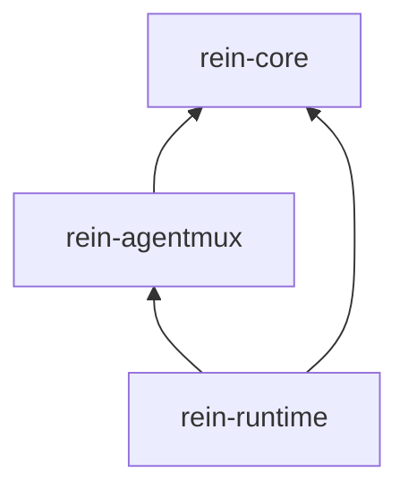

# Rein 功能切分与模块设计

> **现行职责覆盖说明（2026-10-05）**：本文保留旧版设计及历史验收编号。涉及 Coordinator、TaskGraph/DAG、跨 Agent 资源选择、全局预算、修复策略、EvidenceBundle 与整体验收的归属，均由 [2026-10-04 职责决定](DECISIONS.md#职责边界同步2026-10-04) 替代，现归 Veriflow；本文中 Rein 拥有这些职责、Veriflow 仅作方法/投影的表述不再生效。Rein 仅保留单 Agent 运行、局部执行约束、固定检查与原始回执、effect 恢复；Web Studio 负责环境与观测。跨层连接以 [RuntimePort 候选](contracts/runtime-port-v0.1.md) 为准。旧目录和里程碑是历史方案，后续按新决定的 R1–R3 与 Veriflow V1–V4 推进；本次不搬迁源码，也不宣称候选能力已实现。

**REIN — Runtime for Emergent Intelligence Networks**

| 项目 | 内容 |
| --- | --- |
| 版本 | `0.4-draft`，2026-09-21 |
| 状态 | 研究后的模块化设计；本轮未创建产品 crates、迁移源码或运行真实 Agent |
| 输入 | [REIN-DESIGN.md](REIN-DESIGN.md) `0.5-draft` 的 S01–S16；[整合规格](REIN-INTEGRATION-SPEC.md)；[源码调研](reports/2026-09-20-rein-architecture-research.md) |
| 已确认 | REIN 全名；[D12、D13、D14](DECISIONS.md) 的完整 Harness/Coordinator、可恢复步进机制及产品线分工；Rust core / TypeScript 宿主分工 |
| 本文建议 | 三个产品包内的功能组织、委派端口和迁移顺序；步进与 schema 权威方向已写入设计，具体合同与代码尚未实施 |
| 文档分工 | DESIGN 管行为规格；本文管模块归属与依赖；INTEGRATION-SPEC 管跨项目要求和 INT 基准；IMPLEMENTATION-PLAN 管实施顺序；调研报告管来源证据 |

## 1. 架构决定

**Rein core 保留完整 Harness，并能运行 Coordinator 角色调度外部 Agent。** 三个产品包仍为 `core/`、`agentmux/`、`runtime/`；core 内部包含 Harness、智能编排与确定性控制规则。原生 Harness 是首批产品主线，现有实现采用兼容抽取。模型、工具及外部 Agent 的 I/O 经端口注入，core 不依赖具体外部 CLI。

`AgentMux` 是外部 Harness 的多路接入层，目录使用小写 `agentmux/`，Rust package 使用 `rein-agentmux`。它根据已选定的 adapter ID 找到实现，转换配置、控制请求和事件。**哪个任务交给哪个 Agent/账号执行由 core 决定。**

功能区域及其首批物理位置：

| 逻辑层 | 负责什么 | 首批位置 |
| --- | --- | --- |
| Client / Control | 提交、查询、取消、审批响应、事件订阅；桌面展示 | `runtime/src/control` 与 `runtime/src/bin`；Web Studio 独立消费者 |
| Core control | 任务与图、执行状态、策略、资源预留、上下文交接规则、验收 | `core/src/task`、`execution`、`scheduling` 等 |
| Coordinator | 使用同一 Harness 拆任务、委派、观察和处理结果 | `core/src/orchestration` |
| AgentMux | 外部 Harness 的能力、原生配置格式、会话协议和事件翻译 | `agentmux/src` |
| Runtime infrastructure | 存储、受管进程、工作区、秘密后端、产物、验证器执行 | `runtime/src` |
| Core Harness | 模型调用、Agent loop、会话、工具调度、上下文与扩展控制 | `core/src/harness`；兼容抽取现有 Rust 代码，保留 TS 工具宿主 |

本轮用词中的 Runtime 同时是产品名称与产品包名。包 `rein-runtime` 只是装配和基础设施，并不独占 Rein 的所有产品逻辑。

## 2. 源码依赖与运行调用

下图箭头表示源码依赖，不表示事件流：



约束：

- `rein-core` 内部的 Harness、Coordinator、任务控制共同构成完整原生运行时逻辑；core/harness 只做纯状态推进，产出模型、工具与委派意图，不 await 任何 I/O。runtime 经 ModelAdapter、ToolExecutor、DelegationPort 等执行已提交意图。core 不依赖 agentmux/runtime、具体 OS 进程、SQLite 驱动或厂商 SDK。
- `rein-agentmux` 实现 core 的 AgentAdapter/ResourceObserver 等端口；自己的低层 ProcessPort、TransportPort、PrivateProfilePort 由 runtime 实现。它可以使用协议编解码依赖，但不直接 spawn、读 keychain 或写业务数据库。
- `rein-runtime::driver` 只执行 core 产生的效果计划、送回观察；不能自己决定更换账号、验收成功或重试。具体适配器选择与实例化集中在 `composition`。
- `runtime/control` 只依赖应用入口和控制 DTO，不能绕过 core 写表。Harness 决定会话/工具步骤，Coordinator 产生编排提案，core/application 统一校验并提交业务状态/会话进度；runtime/store 提供实际持久写入。
- `core/ports` 是 Rust 内部依赖反转接口；Rust 类型是 wire 合同权威，经 schemars 生成 `contracts/runtime/schemas/*.json`，再由 schema 生成 TypeScript 类型。生成边界与一致性基准最迟 R0 冻结，不手写第二套 DTO。
- 原生步进入口位于 core/harness，NativeAgentAdapter 负责意图/观察与共同生命周期的语义映射，不持有 I/O 循环；AgentMux 只注册外部 Harness。runtime/composition 注入原生模型/工具实现和 AgentMux；委派意图经 DelegationPort 回到统一应用入口，源码依赖保持向内。
- core/task、policy、scheduling 与 core/harness 使用固定快照、时间和观察序列测试。FakeModel/FakeTool 的异步执行放在 runtime 集成测试；TaskApplication 与 Harness 步进都不执行 I/O，机制见第 5.7 节。

AgentMux 的格式和协议模块应能用内存通道测试。core 的确定性控制规则应能只靠固定时间、资源快照和事件序列测试；原生 Harness 需另测实际模型—工具—反馈路径。上述编解码与确定性规则单元测试不应依赖用户 HOME、真实 CLI 或数据库；原生/外部执行的集成验收另行运行并记录其 I/O。

## 3. 精确功能归属

每行只有一个业务主责。协作模块提供事实或执行动作，不能抢占状态判定权。

| 编号 | 功能/状态主责 | 拥有的数据与决定 | 输入 → 输出 | 执行协作 |
| --- | --- | --- | --- | --- |
| F01 | `core/task` | Mission、TaskSpec、TaskGraph、AgentTemplate 版本；图合法性 | 目标/显式图 → 冻结 Spec 或拒绝原因 | control 解析；Planner 只能提出候选 |
| F02 | `core/execution` | Run、NodeRun、Attempt 状态；取消、超时、核对、重试边界 | 命令/观察 → 合法状态转换和效果计划 | driver 执行；AgentMux 返回观察 |
| F03 | `core/scheduling` | 就绪计算、硬过滤、规则排序与提案准入、DecisionTrace | Task + Coordinator/用户提案 + 资源/策略快照 → BindingDecision/等待 | F04 原子预留；保存 F18 提案和最终差异；不接触 secret |
| F04 | `core/resource` | Resource、QuotaPool、Reservation、BudgetLedger、健康/冷却语义 | 额度/用量观测 + 绑定提案 → 容量判定/预留/结算 | store 事务；observer 查询远端事实 |
| F05 | `core/identity` | Identity、Profile、版本与凭证所有权模式的元数据 | 登记/核对事实 → ProfileRef、binding 校验 | AgentMux 解释原生身份；credentials 保管秘密 |
| F06 | `core/policy` | 数据目的地、工具/执行约束、批准请求、撤销和消费规则 | 操作 + 主体/范围/版本 → allow/deny/await | control 收集回复；adapter 翻译批准 |
| F07 | `core/handoff` | ContextBundle 清单、来源、依赖产物与交接规则 | 已验收依赖 + 允许来源 → 内容引用集合 | workspace/artifact 读取有界内容；与 F17 的 core/harness/context 区分 |
| F08 | `core/acceptance` | Evidence 采纳、stale 判定、Acceptance、修复建议 | Spec + 产物 + 检查回执 → pass/fail/undetermined | verification 执行固定检查；F02 驱动修复 |
| F09 | `agentmux/adapters` | NativeSessionRef、协议相关性、解析器/能力版本 | PreparedExecution/控制 → AdapterObservation | ProcessPort/TransportPort；不写任务表 |
| F10 | `agentmux/profiles` | Codex/Claude/pi 等格式规则、原生配置差异 | Profile 配方 + 实测能力 → 原生配置编解码与核对 | PrivateProfilePort 实例化；F05 管版本 |
| F11 | `runtime/credentials` | SecretRef 对应字节、受控句柄、写入/轮换回执 | lease + expected generation → 句柄/冲突 | F05 授权模式；F10 格式转换 |
| F12 | `runtime/process`、`transport` | OS 进程身份、输出通道、进程组、退出证据 | LaunchRecipe + dispatchKey → 进程/连接观察 | F02 决定如何处理未知；不判任务成功 |
| F13 | `runtime/workspace` | 输入快照、目录、OS 写锁、变更清单、整合回执 | WorkspaceSpec + lease → WorkspaceHandle/ChangeSet | F04 持有逻辑写 lease；F08 决定采纳 |
| F14 | `runtime/artifact`、`verification` | 不可变字节与检查执行回执 | 文件/计划/环境 → ArtifactRef/Evidence | core 定义摘要范围与验收规则 |
| F15 | `runtime/store` | 业务状态物理存储、事件 journal、outbox/inbox、幂等、迁移 | 原子 Transition → CommitReceipt | 状态含义和允许转换属于 core |
| F16 | `runtime/control`、`composition` | 连接、鉴权上下文、服务配置、观察游标 | 控制请求 → core Command；事件 → 客户端 | UI 没有独立任务真相 |
| F17 | `core/harness` | 原生会话与纯步进；core/harness/usage 管用量，core/harness/interrupt 管中断，core/harness/context 管局部上下文 | 会话状态 + 一个观察 → 下一意图 + 新 session revision | application 校验后由 F15 提交；runtime/driver/native 执行 I/O；TS 为宿主；跨执行交接归 F07 |
| F18 | `core/orchestration` | Coordinator 角色、计划提案、委派工具、子结果进入父上下文的规则 | 目标/允许能力/子结果 → 自执行、委派或计划调整 | 使用 F17 同一循环；F01/F02/F03/F06 校验与管理父子任务，不自行写终态 |

F12 的操作系统进程表与 F02 的 Attempt 表分别记录物理事实与业务状态；F13 的 OS 锁与 F04 的逻辑 lease 也分别存在。它们不可能靠同一个数据库事务原子完成，必须用回执、核对和补偿连接。

### 3.1 规格完整性映射

| 规格 | 业务主责 | 必要协作者 | 首批完成边界 |
| --- | --- | --- | --- |
| S01 | F01 | F06/F07 | R1 单节点；R3 完整 DAG 校验 |
| S02 | F05 | F10/F11/F15 | R1 单 Profile 最小登记；R2 多主体与轮换 |
| S03 | F02 | F05/F06/F09–F13 | R1 固定绑定；R2 双 Profile 并发实测 |
| S04 | F03 | F01/F07/F08 | R3 依赖验收后就绪 |
| S05 | F03 | F04/F06/F18 | R1 指定/Coordinator 提案准入；R2 多资源规则路由与解释 |
| S06 | F04 | F09/F15/F16 | R1 能表示 unknown；R2 多窗口观测 |
| S07 | F04 | F02/F12/F13/F15 | R1 单资源；R2 多资源/共享池原子竞争 |
| S08 | F02 | F09/F12/F15/F16 | R1 取消、核对与未知结果 |
| S09 | F08 | F01/F13/F14 | R1 固定计划与版本绑定 |
| S10 | F02 | F03/F04/F06/F07/F08 | R2 换资源；R3 产物交接与有界修复 |
| S11 | F02 | F15/F16 | R1 持久状态、事件续读与不盲重放 |
| S12 | F09 | F02/F05/F10–F13 | R1 首个真实路径；R2 双 Agent 能力实测 |
| S13 | F03 | F04/F07/F08 | P1；路由评估与可解释回退 |
| S14 | F16 | F09/F12/F17 | P1；更多 API/本地模型、MCP 控制入口、远程执行扩展；首个原生模型接入在 S15 |
| S15 | F17 | F02/F06/F08/F12/F14/F15 | R1 原生完整 Harness 独立执行与旧入口兼容 |
| S16 | F18 | F01/F02/F03/F04/F06/F07/F09/F15/F17 | R1 首次委派/结果回填；R2 并发；R3 完整有界图编排 |

## 4. 三个最容易放错位置的功能

### 4.1 账号与资源不是一个 Provider

```text
Identity + ProfileVersion + CredentialRef       core/identity
                    ↓
ResourceSnapshot + QuotaPool + Reservation      core/resource
                    ↓
ExecutionBinding + PolicyDecision              core/execution + policy
                    ↓
NativeConfigRecipe                             agentmux/profiles
                    ↓
PrivateRuntimeHandle + LaunchReceipt           runtime/credentials + process
```

`ModelProvider` 表示模型 API；`AgentAdapterId` 表示外部 Harness；`fundingSource` 表示订阅/API/本地/席位；`executionEnvironmentRef` 表示本地或远端运行位置。它们是独立维度，合法组合由能力与策略共同校验。

`AgentTemplate` 表示 scout、planner、coder、reviewer 等角色配方；它引用版本化提示和工具策略，可以由多个 adapter 执行，不绑定某个登录主体。模板展开后进入冻结 TaskSpec 与有效执行配置；任务的角色名称不构成权限。

Profile 的凭证模式必须明确为经过验证的一种：原生 Agent 独占管理、Rein 受管后端、外部凭证代理。缺乏证据时不自动复制 refresh token；同时存在两个写入者时拒绝该绑定或串行化。秘钥保管实现与 CLI 原生格式知识分开，core 只看到引用、generation 和回执。

额度显示可以 unknown；未知额度不等于没有账号。可用余额、usage 与预留分开保存，健康探测也必须说明是否消耗请求或费用，不能把探测伪装成零成本查询。

### 4.2 调度 Agent 与确定性调度器

Coordinator 负责提出“拆成哪些任务、自己做还是交给谁、如何根据反馈调整”；TaskScheduler 负责检查这些选择是否可执行并完成准入。两者都在 core 内，但一个使用模型推理，另一个执行确定性规则。用户直接指定或规则模式可跳过模型规划，避免每个简单任务都增加协调调用。

具体执行层还区分以下四种路由/调度：

| 名称 | 调度单位 | 是否可以更换账号 | 与外层任务的关系 |
| --- | --- | --- | --- |
| TaskScheduler | TaskNode 的下一次 Attempt | core 在新 Attempt 中重新授权后可以 | 检查用户/Coordinator/规则选择，权威派发入口 |
| ModelRouter | 内置 Agent 的下一次模型调用 | 仅限预先授权的模型/资金路径；越界需外层批准 | 消耗外层预算；首批不引入学习路由 |
| EndpointRouter | 同一 API 请求的上游端点 | 不能隐式跨越原绑定 | 将重试/未知消耗报告给上层；延后独立 gateway |
| ToolScheduler | 单 Agent 的 ToolCall | 无此职责 | 工具批准与并发服从外层策略 |

AgentMux Registry 只做 `adapterId → implementation` 查找，不是第五种任务路由器。对外部 Harness，Rein 可以指定模型偏好、允许集合及记录实际值；若无法控制其内部模型路由、子 Agent 或工具执行，就不能承诺相应硬约束。

ModelRouter 与 ToolScheduler 首轮合并在 `core/harness/agent_loop.rs` 的纯决策逻辑中，后续随规模拆分；模型请求和工具执行仍由 runtime driver 完成。

### 4.3 验证执行与验收决定

Agent 输出、Verifier 退出和用户是否采纳是三个来源。`runtime/verification` 执行冻结的 VerificationPlan 并生成回执；`core/acceptance` 检查 Spec/输入/产物/验证器版本是否匹配，产生 Acceptance。Veriflow 提供方法和规则包，其 adapter 位于 runtime 验证边界，调用固定版本 CLI；投影、原始 gate 结果及单执行者语义见 [整合规格](REIN-INTEGRATION-SPEC.md)。Rein 持有唯一任务运行状态，Veriflow 投影不另作可写状态源；校验器不证明原始用户授权或产品正确性。

基准门槛由 core/application 与 acceptance 按固定规则执行：生产写入前检查当前 Spec 的必需实现前记录，运行时具体检查与原始回执由 runtime 负责。Web Studio 在 R1c 消费控制与证据接口，其 Swift UI/工作区归属保持在独立仓库；应用窗口断开和取消任务具有不同语义。网页 verifier 与原生交互验收各自留证。

提交、合并、发布、回写到用户目录是另一个被授权的效果，不随 Acceptance 自动发生。验收基线发生变化时，原证据保留为历史，当前状态标记 stale。

## 5. 最小领域对象与端口

### 5.1 对象不能混用

| 对象 | 最小字段/语义 |
| --- | --- |
| TaskSpec | specId/version/digest、inputRefs、outputContract、workspaceSpec、policyRef、budget、verificationPlanRef |
| AgentTemplate | templateId/version、instructionsRef、role、toolPolicyRef、modelPreferences；instructionsRef 指向 runtime/artifact 中按内容摘要保存的不可变提示词；Coordinator/Worker 使用同一 Harness，引擎相同不等于权限相同 |
| HarnessSession | sessionId/revision、messageRefs/contextRefs、toolResultRefs、pendingToolCalls、usage、waitReason、observationCursor/resultCursor、checkpoint；消息体与工具结果按内容摘要存入 runtime/artifact，会话行仅保存引用、游标、revision 及必要控制元数据，不复制完整消息体；交换 schema 也使用引用形式 |
| DelegationLink | delegationId、rootRunId、parentSession/attempt/toolCall、childRun/attempt、depth、budgetGrant、policyRef、resultCursor、state；身份由执行上下文提供，不能信任模型自报 |
| Run / NodeRun | runId、graphVersion、nodeId、specRef、state、revision；Run 不用外部 sessionId 代替 |
| Attempt | attemptId、nodeRunId、attemptNo、bindingRef、dispatchKey、state、revision、nativeSessionRef、outcome |
| ExecutionBinding | adapter/version、profile/version、subject/org、fundingSource、modelConstraints、environmentRef、capabilityReportRef、policyDecisionRef、reservationIds |
| AdapterObservation | attemptId、adapter/version、sourceEventId/cursor、kind、observedAt、payload、rawArtifactRef；由 core 去重采纳 |
| QuotaObservation | resource/pool/window、value/unit、observedAt/expiresAt、source、confidence、unknownReason |
| UsageObservation | attempt/childRef、provider/model、units、cost、source、coverage、estimated/authoritative/unknown；未知金额不能填 0 |
| ApprovalRequest | approvalId、attemptId、nativeRequestRef、actor/scope、effectDigest、policyVersion、expiresAt、state、consumedBy |
| Artifact / Evidence | 内容摘要、生产 Attempt、输入与 Spec 引用；Evidence 加 verifier/version、环境、exit/outcome、原始结果引用 |
| Acceptance | specRef、artifactRefs、evidenceRefs、policyVersion、decision、reason、revision；不写入 Agent 自述的 success |

字段表固定职责与必要语义；正式 DTO、枚举、摘要规范化算法及 Rust → schemars JSON Schema → TypeScript 的生成合同最迟在 R0 冻结，不能直接当作已实现 API。领域事件的权威 Rust 类型位于 `core/events/domain.rs`；`runtime/control/dto.rs` 只定义 wire 信封/控制 DTO 并引用领域事件类型，不另写一份事件 payload，`event.schema.json` 是生成物。凭证字节、OS 私有句柄与完整 native 配置不放入通用事件 DTO。

### 5.2 Core 应用入口

```text
TaskApplication.handle(command, consistentSnapshot, now)
  -> Rejected | Transition

Transition {
  expectedRevisions,
  stateChanges,
  domainEvents,
  effectIntents,
  commandIdempotencyKey
}

StateStore.commit(transition) -> Committed | VersionConflict | Unavailable
StateStore.readRun(runId) -> RunSnapshot
StateStore.readEvents(runId, afterSequence, limit) -> EventPage
```

`handle` 判定规则，不执行外部 I/O；快照/提交必须覆盖它读取和修改的所有实体版本，包括共享池、批准、工作区逻辑 lease。冲突后重新读取再决定，不能仅检查 Run revision。提交时同一事务写业务状态、事件和 outbox，并分配 run sequence。

effectIntent 表达 Prepare、Dispatch、RespondApproval、Cancel、Inspect、SealArtifact、Verify、Integrate 等具体动作，携带幂等身份。driver 不推导业务规则。事件重放更新投影，outbox 的重启处理则按每种效果的可核对性决定，二者分离。

Harness 的正常消息/工具进度也按 session revision 提交；模型输出不能直接修改任务状态。应用层校验后写入的 DelegationLink 连接原生会话和子任务。每步的会话变化与下一效果意图一起提交，提交成功前不能执行新意图；观察及等待恢复见第 5.7 节。

### 5.3 Agent 执行端口

```text
AgentAdapter
  describe() -> AdapterDescriptor
  probe(profileRef, environmentRef, probePolicy) -> CapabilityReport
  prepare(binding, provisionedContext) -> PreparedExecution
  start(preparedExecution, dispatchKey) -> StartReceipt
  observe(nativeSessionRef, afterCursor) -> stream<AdapterObservation>
  inspect(nativeSessionRef, dispatchKey) -> ExecutionObservation
  answerApproval(nativeRequestRef, authorizedDecision) -> DeliveryReceipt
  cancel(nativeSessionRef, reason) -> CancelReceipt
  describeOutputs(nativeSessionRef) -> OutputHints
  close(nativeSessionRef) -> SessionCloseReceipt
```

`prepare` 只在已经分配的工作区与私有配置句柄上转换启动计划；文件系统准备和秘密实例化由 runtime 完成。`describeOutputs` 只返回外部 Agent 声称的路径/结果线索，ArtifactStore 要重新验证范围、类型、字节和哈希。`close` 只负责适配器/会话资源；工作区删除、凭证回收、进程树终止分别由对应基础设施处理。

StartReceipt 区分 `started`、`not_started`、`unknown`；取消请求收到不等于进程已退出。`answerApproval` 必须对应已持久批准，并核对原生请求是否仍等待；投递不确定时进入核对，不能重复创建一份批准。不支持双向批准的 adapter 明确报告 unsupported，适用任务在派发前过滤。

资源事实查询也通过独立 `ResourceObserver.observe(resourceRef, probePolicy) → ObservationBatch` 端口返回。AgentMux 实现官方 CLI 可提供的观测；未来 API adapter 实现其自身观测。它只返回来源事实，无权 reserve、release 或选资源。core/resource 采纳观测和修改账本，runtime/store 原子持久化。

### 5.4 AgentMux 内部反转端口

```text
ProcessPort.launch(launchRecipe, dispatchKey) -> ProcessReceipt
ProcessPort.inspect(processIdentity) -> ProcessObservation
ProcessPort.stop(processIdentity, stopPlan) -> StopReceipt
TransportPort.connect(endpointRef, protocolLimits) -> Channel
PrivateProfilePort.prepare(profileRecipeRef, leaseRef) -> PrivateRuntimeHandle
PrivateProfilePort.reconcile(handle, expectedGeneration) -> ProfileReceipt
```

端口在 `agentmux/ports` 定义，由 runtime 实现；core 无须知道某个 CLI 需要怎样的 socket、信号或文件格式。AgentMux 可保留本地协议连接状态，但需向 core 提供可持久化的恢复引用；不能持有唯一一份恢复所需信息而只存在内存。

### 5.5 能力是矩阵

CapabilityReport 以 `adapter + executable version + platform + integration mode + auth mode` 为键。每项包含 supported/unsupported/unknown、限制、测试证据引用与时间；官网存在某接口只算候选能力。

至少逐项记录：独立配置、实际主体核对、结构化输出、事件续读、原生会话恢复、服务重启核对、请求取消、确认退出、回收后代、工具策略、双向批准、隐藏 hooks/MCP 的发现与约束、模型控制、子 Agent 的观测与上限、额度窗口观测、费用计量与硬上限。不能把这些压成单个 `supportsResume` 或 `isSecure`。

### 5.6 Coordinator 的委派工具与回路

Coordinator 使用 core/harness 的普通工具机制。`core/orchestration` 定义委派工具语义，DelegationPort 将调用送到同一 TaskApplication，再由 runtime 驱动已提交的效果。下面是内部工具名草案，不是已发布 CLI 或对外 wire API。

| 工具 | 语义 | 约束 |
| --- | --- | --- |
| `agents.list` | 读取当前主体可见的 Agent/资源与能力 | 脱敏快照；查询结果不是执行授权 |
| `agents.delegate` | 提交子 Spec、资源偏好、输入引用与子预算，返回委派句柄 | 同一父 tool call 幂等；校验范围/额度/工作区/深度；先持久化再启动 |
| `agents.status` | 查询子任务与是否需要批准、核对或验证 | 状态来自 core，不能用最后一段模型文本代替 |
| `agents.await` | 由步进机产生 WaitChildren 意图，父会话进入持久等待状态 | 有界等待；提交 waiting_children、句柄与游标后释放活跃模型槽，重启按第 5.7 节继续，不序列化 Future |
| `agents.result` | 读取产物、验证结论、失败证据与版本引用 | 未验收结果标明性质；消费游标用于去重 |
| `agents.cancel` | 请求取消属于允许范围的子执行 | 收到请求不等于已退出；未知继续核对 |

```text
Rein Harness（Coordinator 角色）
  → 模型提出委派工具调用
  → core policy / TaskApplication / TaskScheduler 校验并持久化
  → DelegationPort 的 runtime 装配 → AgentMux → 外部 Harness
  → 子执行状态、产物与证据 → core 持久化和去重
  → Coordinator 工具结果回填 → 同一 Harness 的下一模型轮次
```

父模型也可以选择本地工具直接完成任务。原生模型服务由 ModelAdapter 接入，不以 Codex/Claude CLI 的存在作为独立运行前提。Coordinator 使用的 API/本地模型、费用和授权单独登记；有外部订阅不等于已有协调模型资源。

委派树与数据依赖 DAG 分开保存：父等待子结果并不要求子先依赖父的 Acceptance。根预算覆盖父模型、工具、子任务和验证器，账本按执行身份去重，不能把已含子用量的汇总再次相加。根策略给出最大深度、并发子任务数和子预算上限；首轮建议只允许一层委派，具体数值在 R0 冻结。

等待释放的是活跃计算槽。父会话 checkpoint、在途副作用、凭证写 lease 和工作区锁仍须按事实保存；如果子任务与父争用不可移交的资源，准入应拒绝或选择允许的替代，不能排出无法前进的队列。父取消时记录对子任务的取消意图；父重启后先核对已有 child，再继续模型循环，不重新发一次 delegate。

<a id="harness-session-step"></a>

### 5.7 HarnessSession 的可恢复步进合同

依据 [D13](DECISIONS.md)，`core/harness/agent_loop.rs` 定义同步、纯状态推进接口。它接收一份会话状态和一个规范观察，返回下一步意图及会话 revision；不调用模型、工具、存储、时钟或任何其他 I/O，也不持有待序列化的 Future。下列名称是待 R0 冻结的 Rust 接口草案，尚未实施：

```text
HarnessStep.advance(sessionState, observation)
  -> Rejected | Duplicate | SessionTransition {
       expectedRevision,
       nextRevision,
       sessionPatch,
       acceptedObservationId,
       nextIntent,
       events
     }

observation = Start | ModelTurn | ToolResult | ChildResult | Cancel | Timeout
nextIntent  = CallModel | ExecuteTool | WaitChildren | Finish
```

观察包含 session/attempt/call 关联、唯一 observationId、显式时间及必要事实；消息体和结果使用摘要引用。Start 用于初次启动；模型 turn、工具结果、子结果、取消和超时均通过同一入口推进。相同状态和观察产生相同结果；采纳一个新观察时 `nextRevision = expectedRevision + 1`，重复或被拒绝观察不推进 revision，不重新生成效果。效果 ID 绑定 session、revision 与调用身份。

`CallModel` 携带模型绑定与输入引用，`ExecuteTool` 携带调用身份、参数/授权引用，`WaitChildren` 携带委派句柄、消费游标与截止时间，`Finish` 表示请求结束会话规划。`Finish` 不等于任务验收或在途效果已停止；取消/超时涉及的停止、未知结果核对及 Attempt 终结条件仍由 application 调用 execution/policy 等规则判定。审批未满足时 application 持久等待并阻止效果派发，不能让 driver 自行放行。

控制流固定为：

1. `runtime/driver/native.rs` 收集观察，将新的消息体/工具结果持久写入 `runtime/artifact` 并取得摘要引用；按持久状态读取会话与待处理观察。
2. driver 将观察交给 TaskApplication；application 调用 HarnessStep，校验会话及相关实体 revision、权限、预算和委派约束，形成统一 Transition。
3. runtime/store 原子提交会话引用/游标/revision、观察去重记录、领域事件及下一效果意图。提交冲突则重读重算，提交失败不执行新意图。
4. driver 只执行已提交意图，按需解析输入引用、await ModelAdapter/ToolExecutor/DelegationPort；执行结果再次作为观察进入步骤 1。每次采纳观察后都经 TaskApplication 提交会话进度，不等整个循环结束才落盘。

`agents.await` 使父会话进入持久 `waiting_children`，提交后释放活跃模型槽；driver 订阅/查询子任务状态，以 ChildResult 观察唤醒同一父 Session/Attempt。重启读取检查点、委派句柄和结果游标，先核对子执行，再从下一可执行意图继续；不序列化 Future，不重新发出已提交的 delegate。等待不自动释放仍被实际效果占用的进程、凭证 lease 或工作区锁。

消息体先存产物、状态后提交；产物写入失败不得提交悬空引用。产物已存但事务失败时可暂留未引用对象，不据此认为步骤成功。派发后崩溃仍可能产生未知效果，沿用第 6 节的核对规则，不能因采用步进机就宣称外部 exactly-once。

## 6. 状态与副作用的连接

以下为模块协作约束；细化的全状态转换表在实施 R1 时冻结。

| 步骤 | core 决定与事务 | runtime / AgentMux 动作 | 故障后处理 |
| --- | --- | --- | --- |
| 提交 | 验证 Spec，记录 Run 与幂等键 | control 返回持久 ID | 提交未确认则用同键查询/重试 |
| 预留 | 固定 Binding，预留预算/写 lease，写 Prepare intent | 建工作区、实例化 Profile、核对身份 | 未发送任务输入可记录准备失败；逻辑释放仍需清理回执 |
| 派发 | 准备回执匹配后写 Dispatch intent；记录派发阶段 | 用 dispatchKey 启动/发送 | 崩溃窗口无法确认时 outcome_unknown，禁止直接重发 |
| 运行 | 去重采纳事件；更新预算/批准等待 | 持续读取，有界缓冲，私有 raw log 封存 | 协议缺口可见；终态与批准事件不可静默丢弃 |
| 批准 | 校验回复主体/范围/版本；写授权投递 intent | adapter 回传原生等待请求 | 消息迟到、撤销或投递未知先核对 |
| 取消 | 记录取消意图和截止时间 | 原生 interrupt，必要时按已授权计划终止进程组 | 进程或副作用未知则维持占用/隔离，不安全释放 |
| 收集 | 要求执行停止或取得可证明的冻结边界 | 检查目录与路径，封存不可变产物 | 不能对仍在写入的文件生成“固定版本通过” |
| 验证 | 固定 VerificationPlan/版本 | 在声明环境运行检查并封存原始回执 | 检查失败为 fail；无法执行为 undetermined |
| 采纳 | 检查版本一致，写 Acceptance，再使依赖就绪 | 客户端展示结果 | 整合后新版本必须按要求重验 |
| 恢复 | 读取待处理 intent、lease 和未知执行 | inspect 原生会话/真实进程/工作区 | PID 必须结合启动时间等身份核验；不以 lease 超时推断旧进程消失 |

Dispatch intent 不能天然实现外部 exactly-once。若 CLI 不支持查询 dispatchKey，存储与发送间的不确定窗口就必须保留 unknown，不能用“outbox 自动重试”掩盖重复启动风险。数据库控制的是意图与业务提交，无法撤回已经发生的文件或网络效果。

## 7. 建议目录

以下均为拟实施结构，省略未到阶段的空目录；本轮不创建占位源码。

展开到文件级的完整产品布局、保留的教学目录及运行时数据位置见 [REIN-FILE-TREE.md](REIN-FILE-TREE.md)。

```text
Agent-Learning/
  Cargo.toml                   # 新产品 workspace：core、agentmux、runtime；exclude rust
  Cargo.lock                   # 产品锁文件；旧 rust/Cargo.lock 保留
  core/                        # package rein-core
    src/
      lib.rs
      harness/                 # 纯步进、session、usage、interrupt、局部 context、扩展控制
      orchestration/           # coordinator 角色、委派工具、结果回填
      task/ execution/ scheduling/
      resource/ identity/ policy/
      handoff/ acceptance/
      application/ ports/ events/
    tests/
  agentmux/                    # package rein-agentmux
    src/
      lib.rs
      registry.rs
      ports/                   # 仅低层依赖反转端口
      profiles/                # 原生配置格式和核对
      adapters/
        fake/ codex/ claude/   # 分阶段创建
        pi/ gemini/            # 后续需求；不先写空壳
    tests/                     # 协议样本、版本能力与适配合同
  runtime/                     # package rein-runtime
    src/
      lib.rs
      bin/rein.rs
      bin/reind.rs
      composition/ driver/ control/
      store/ process/ transport/ credentials/
      workspace/ artifact/ verification/
      models/ tools/           # 原生模型网络适配、文件工具和 Node host I/O
    migrations/
    tests/                     # 进程、持久化、恢复与纵向链路
  contracts/runtime/           # wire schema、错误、版本、规范样本
  fixtures/runtime/            # 可复现输入、进程/协议故障场景
  rust/                        # 现有独立教学 package 与兼容入口
  ts/                          # 现有教学/参考宿主
  book/ docs/ chapter-snapshots/ # 按现行索引与历史含义保留
```

新 workspace 显式排除旧 `rust/`，保留独立锁文件和章节命令；path 依赖桥仍有双锁解析/重编译代价，见 [兼容桥迁移条目](MIGRATIONS.md#rein-core-bridge)。原生 Harness 从首轮把现有 async 循环兼容改造为 core/harness 纯步进机 + runtime driver，旧包暂提供 wrapper/re-export；抽取时逐项保持公开行为与旧测试输入。

`core` 与 `runtime` 都是单个 crate，编译器不能约束其内部所有 import。除 crate 图外，拟定的 `scripts/runtime/check-boundaries.mjs` 还需检查下表的内部依赖，以及 runtime/control、driver、store 的写入边界；只建文件夹不足以证明分层。

| 引用方 | 允许的领域依赖方向 | 禁止项 |
| --- | --- | --- |
| harness | harness → ports/events；可用公共 ID 和只读值类型 | 不直接 import execution、acceptance 的状态变更接口；不反向 import application，不执行 I/O |
| orchestration | orchestration → harness/ports；可用公共 ID 和只读值类型 | 不直接 import execution、acceptance 的状态变更接口；不另建任务提交入口 |
| application | application → 其余所有领域模块 | 不依赖 runtime/agentmux 的具体实现，不执行 I/O |

harness/orchestration 对任务或验收状态的变更必须经 application 统一校验；它们通过 ports 表达请求/意图，由 runtime 装配回 application，避免反向 import 形成环。公共只读投影不包含状态变更方法；检查需要覆盖重导出和别名，不能通过转发路径绕过禁止项。独立平台包、modelmux、gateway、web UI 和 plugin marketplace 都不在首轮创建。

## 8. 客户端与扩展接口归属

| 表面接口组 | 示例动作 | 所属模块 |
| --- | --- | --- |
| 任务控制 | submit/get/list/cancel、显式 graph | control → F01/F02 |
| 审批 | list/answer/revoke | control → F06 → F17 原生工具执行或 F09 外部审批回传 |
| 资源 | profiles/register/inspect、resources/list、quota/refresh | control → F05/F04 → adapters/credentials |
| 结果 | artifacts/read、verification/get、acceptance/get | control → F08/F14，按访问规则读取 |
| 观察 | events/subscribe、快照与 cursor_expired | control → F15 |
| 内置工具扩展 | 一次 read/apply/verify 等调用 | core/harness + runtime/tools + TS host；沿用 0.1/0.2 语义 |
| Coordinator 工具 | list/delegate/status/await/result/cancel | core/orchestration → 同一应用入口；AgentMux 执行外部协议 |
| MCP | P1 的 Rein 控制入口或 Harness 使用外部工具 | 两种方向分别实现，不能直接绕过 core 变更 Run |

表中的方法是语义分组，不提前宣布正式 wire 方法名。控制协议、外部 Agent 协议和工具扩展协议分别协商版本。客户端重连只恢复观察；禁止让 TUI/桌面成为持久任务继续运行的前提。

## 9. 当前源码怎样处理

| 当前路径 | 实际能力/耦合 | 目标归属与迁移方式 |
| --- | --- | --- |
| `rust/src/rein/mod.rs` | Message/Turn 与具体 HTTP 转换、文件工具混在一起 | messages/模型端口/上下文归 core/harness；具体 HTTP 与文件 I/O 归 runtime/models、tools，保留兼容导出 |
| `rust/src/rein/loop.rs` | async 函数在内存中 await 模型/工具；端口、局部循环与预算、具体适配器同文件 | 兼容改造为 core/harness/agent_loop.rs 纯步进机 + runtime/driver/native.rs I/O driver；经 application 逐步提交 revision；Coordinator 使用同一步进机；保留旧 async 包装入口，不把 LoopResult 重命名为 Run |
| `rust/src/rein/extension02_executor.rs` | 一次工具一个 Node 子进程；内存记录/审批；按 CARGO_MANIFEST_DIR 找宿主 | 协议控制归 core/harness/extensions；进程和宿主定位归 runtime/tools、process；保持单调用语义 |
| `ts/src/rein/extension02-host.ts` | 单调用工具宿主、夹具范围文件摘要 | 维持 TS reference host；产品宿主的路径、资源限制另验，不能宣称它是 OS sandbox |
| `rust/src/rein/maintenance.rs` | 单文件候选、基线、批准与回读 | 保持教学合同；产品 ChangeSet/Approval 类型新增，不直接扩大旧权限 |
| `rust/src/rein/maintenance_session.rs` | 同步 FnMut 生成/批准、有限修复、内存事件 | 复用规则思想；产品异步等待、持久批准和修复由 F02/F06/F08 新建 |
| `rust/src/rein/context_methods.rs` | 局部上下文策略实验 | 局部内容策略归 core/harness/context；跨执行版本/身份交接归 core/handoff（F07） |
| `contracts/extension-v0.1.md`、`extension-v0.2.md` | 已有工具边界 | 保留含义；runtime 控制与 Agent 适配另建合同 |
| `.github/workflows/test.yml` | 原路径触发与教学检查 | 开始产品实现时加入新目录、合同、迁移、恢复与适用平台检查 |

首轮先保全原生 Harness 行为和兼容入口，再接入委派。完整 Harness 是 core 的持续产品能力；Task 控制、Coordinator 与 loop 通过清楚的内部接口协作，具体 I/O 则由 runtime 注入。

## 10. 分批实施与可验证结果

| 批次 | 实施内容 | 完成证据 | 仍不表示什么 |
| --- | --- | --- | --- |
| R0 | 锁定步进/引用式会话/正式 DTO 合同与 Rust → schemars schema → TS 权威方向；Codex/Claude 探测；旧教学基线 | schema/能力报告；明确 unsupported/unknown | 不代表双 Agent 接入完成 |
| R1a | 三包边界、async 循环兼容改造为纯步进机 + driver、单节点任务/引用式会话持久化、Model/Tool 端口、CLI | 无外部 CLI 运行原生闭环，逐步提交及旧基准通过，取消/验证/未知状态成立，覆盖 V19 | 不代表真实外部委派完成 |
| R1b | 同一 Harness 的 Coordinator 角色、委派工具、FakeAgent 故障基准、首个真实 adapter | 父委派—子完成—结果回填—父继续；等待/取消/恢复不重派，V20–V22 单子任务范围 | 不代表完整 P0 或双账号隔离 |
| R1c | 固定 Veriflow adapter、Control API 与 Web Studio 最小消费者、隔离网页样例、任务交付 | INT-S01–S07 与 INT-B01–INT-B12；外部浏览器与原生 UI 分别留证，R1a/R1b 里程碑同时完成 | 不代表 INT-S08 正式发行或完整 P0 |
| R2 | 第二适配器、多 Profile、共享池、Coordinator/规则选择与受控 fallback | 父子汇总预算、两主体并发、轮换、预留、跨资源隔离及 V21/V22 并发场景 | 不代表 DAG/交接已验收 |
| R3 | DAG、ContextBundle、已验收产物依赖、有界修复 | V01–V22 中全部适用 P0 场景及原生/Coordinator/真实双 Agent 冻结任务集 | 不代表完整桌面体验、正式发行或远端执行已交付 |
| R4 | 扩展 Web Studio 垂直体验与三产品发行链路 | INT-S08 的安装、兼容、适用签名/发行及原生交互证据 | 不用源码构建或试用包代替正式发行验收 |
| R5 | 更多模型 API/本地模型、评分路由、MCP 与远程能力 | 各分支自己的相同基准与回归；优化有冻结对照任务集 | 不以代码目录或 demo 代替产品证据 |

R1a 先冻结能让错误实现失败的基准，再委派 coder 实现；主线程审查 diff 和结果。R1c 在 R1a 控制/证据合同稳定后可与 R1b 并行开发，产品里程碑同时核对二者证据，不等待 R2/R3。R0 的第二适配器探测不阻塞原生或最小客户端路径；R1b 仍须首个真实适配证据。目录迁移若发生，旧 Rust/TS 相关测试和混合宿主命令必须按原基准复跑。

建议加入的关键边界检查：

- 在 core 依赖图中引入 SQLite/Tokio process/Agent SDK 会被拒绝；在 AgentMux 引入 runtime 反向依赖会被拒绝。
- core 内部也执行第 7 节的依赖表：harness → ports/events，orchestration → harness/ports，application → 其余所有领域模块。harness 与 orchestration 不得直接 import execution、acceptance 的状态变更接口，包括重导出/别名绕行；变更只能经 application 或 ports。
- core/harness 不得 await 任何 I/O；固定会话和观察应产生相同意图/revision。runtime 原生路径需检验提交失败零新派发、重复观察不重复执行、等待/重启沿同一父 Session/Attempt 恢复。
- 会话检查点只提交消息/工具结果引用、游标与控制元数据；大消息不随每轮复制，缺失产物不能生成已提交的有效引用。Rust 类型经 schemars 生成 schema 再生成 TS，检查不维护第二套手写类型。
- 两个并发预留抢同一剩余槽，只能派发一次；迟到事件不能复活终态；存储不可写时不产生新进程。
- 外部 prompt accepted、turn completed、exit 0 均不能绕过验证直接生成 Acceptance。
- 进程写文件后连接丢失、取消无回执、服务重启时派发窗口不明，都保留 unknown，检查真实派发计数。
- 冻结事件样本重放可验证 parser；真实账号隔离、进程树回收、秘密轮换必须另取对应平台证据。
- 原生 Harness 无需外部 CLI 可运行；Coordinator 委派的结果确实进入下一模型请求。超预算/越权/递归受限时观测实际派发为零。
- 父等待与取消/重启、子结果重复/未知均有对应反例；保留真实进程与派发计数，不能只检查工具返回枚举。
- 兼容 bridge 若存在，退出后原生产品闭环与历史命令按同一基准继续成立。
